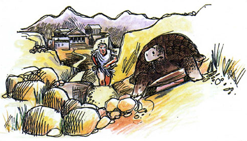
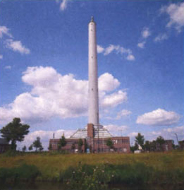

# 1 The description of motion

The concepts that have been developed to allow the description of motion - concepts such as *speed*, *velocity* and *acceleration* - are now so much a part of everyday language that we rarely think about them. Just consider the number of times each day you have to describe some aspect of motion or understand an instruction about motion; obey a speed limit or work out a journey time. We may take the description of motion for granted, but the concepts involved are so fundamental and so much depends upon them that they really deserve careful consideration. This was clearly understood by Einstein, but it was also well known long before his time.

To the ancient Greek philosopher Zeno, motion seemed such a self-contradictory feature of the world that he and his followers became convinced that the apparent existence of motion only served to indicate the fundamental unreliability of our senses. For Zeno the description of motion was not only a fundamental problem, it was, perhaps, *the* fundamental problem.

__Figure 1:__ The paradox of Achilles and the tortoise. Achilles moves faster than the tortoise, but each time he reaches the previous position of the tortoise the tortoise has moved on. The gap gets smaller and smaller but, according to Zeno, never completely vanishes. Does this really mean that Achilles can never quite catch up with the tortoise? Such a conclusion would clearly conflict with our everyday experience of how things move

Zeno's arguments against the reality of motion are still remembered because of three paradoxes he based upon them. The best known of these paradoxes concerns a race between the ancient hero Achilles and a tortoise (Figure 1). Naturally, Achilles can run much faster than a tortoise, so the outcome of the race seems obvious. Even if the tortoise is given a head start, Achilles will quickly overtake it and go on to win the race. However, Zeno argued, this cannot really be the case. According to Zeno, whatever head start is given to the tortoise, Achilles will take some time to reach the starting position of the tortoise and during that time the tortoise, no matter how slowly it moves, will have reached some new position, still ahead of Achilles. Now, starting from the tortoise's original position, Achilles will take a much shorter time to reach the new position of the tortoise, but by the time he does so the tortoise will again have moved on a little, so the reptile will still be ahead of the athlete. In Zeno's view this process can go on forever with the tortoise always moving on, at least a little, in the time that Achilles takes to reach its previous position. Achilles, according to Zeno, will never quite manage to close the gap. Since this conclusion disagrees with everyday experience, Zeno concluded that everyday experience was misleading. Unlike most modern scientists, Zeno preferred to trust his reason rather than his experience of the world.

Modern science is able to resolve Zeno's paradox. Motion is not in conflict with reason, but the resolution relies on mathematical concepts that were not known to the ancient Greeks, nor even to Galileo. This course deals with motion along a line and with the ways in which such motion can be represented. It will show you how *graphs* can be used to depict motion and how *equations* can provide even more powerful summaries of such graphical information. Crucially, it will also introduce you to some of the basic ideas of *differential calculus*, the branch of mathematics that concerns small changes and their influence.

Click to view part 1 of Newton's Revolution
<!--MEDIACONTENT--><video xmlns:str="http://exslt.org/strings" width="80%" download=""><source src="https://www.open.edu/openlearn/ocw/pluginfile.php/65607/mod_oucontent/oucontent/439/s207_2_001v.mp4" type="video/mp4"></source></video>

Video 1

<!--TRANSCRIPT--><table xmlns:str="http://exslt.org/strings" border="1"><tr><td>
__JOHN:__ *Here's an intriguing experiment. The cannon on this train is pointing vertically upwards. When a ball is fired from it, it goes straight up and straight down. But what would happen if the cannon was fired when the train was in motion? Will the ball land... near the cannon...? or behind the train...? or where? What do you think?*;
*Well, it lands more or less back on the cannon.*;

__JOY:__ *Maybe that experiment surprised you. Many of our intuitive ideas about motion are wrong and yet they were embodied in the theories of one of the greatest thinkers in history - Aristotle. He lived in Greece in the fourth century BC. He was a pupil of Plato and tutor to Alexander the Great...*;

__ARISTOTLE:__ *Do you still consider the Universe illogical? Does not nature enjoy simplicity and go about its business by means of laws every bit as rigorous as those which govern the affairs of men?*;

__ALEXANDER:__ *Then what law, master, decrees that a stone, hurled into the air, must always fall back down to Earth?*;

__ARISTOTLE:__ *An excellent question! And here we have a stone to provide you with an answer. See, it sits, on the floor, immobile. Now why is it motionless?*;

__ALEXANDER:__ *Because it has nothing to make it move.*;

__ARISTOTLE:__ *Correct. It is in its natural state, at rest. Only if I force it to move, so...*;
*... is its natural resistance to movement overcome. When I cease to exert an influence, it ceases to move. In other words, for a stone to be in motion, there must be a reason, a cause - a force - to persuade it to move.*;

__ALEXANDER:__ *For the stone to rise into the air, I must provide a force to lift it.*;

__ARISTOTLE:__ *Just so.*;

__ALEXANDER:__ *And yet, when I let it go, it falls, without any prompting from me.*;
*I applied no force to make it move downwards. Did I?*;

__ARISTOTLE:__ *Look all around you, Alexander. Do you see any heavy object that is not resting on the ground?*;

__ALEXANDER:__ *No, master.*;

__ARISTOTLE:__ *That is because all heavy objects naturally exist on the ground. Though you might perform a violent action in raising that stone, it will always try to return to the ground where it belongs. As soldiers, sent to battle, yearn for home, so a stone raised in the air will want to return to its proper place. That tendency, in itself, is a force of nature, whereby all heavy objects will take the most direct route to the ground, by falling vertically downwards.*;

__ALEXANDER:__ *I comprehend. Master, might I ask - If I were in a chariot, drawn by four strong horses, and I raised a stone above my head, and let it fall - would it land at my feet in the chariot?*;

__ARISTOTLE:__ *Is your chariot moving at speed?*;

__ALEXANDER:__ *Oh, yes! Like Phoebus' chariot, charging through the heavens!*;

__ARISTOTLE:__ *Well, your stone would fall vertically, taking the straightest route to the ground, while your chariot moves forward, away from the direct path of the stone. In consequence, the stone would fall behind your chariot. Why, in the time it takes for your stone to return to its natural place, your chariot would have sped on many paces! It is the same as if you let fall a stone from the mast of a ship. If the ship were moving fast over the sea, the stone would plunge into he waves behind it.*;

__ALEXANDER:__ *Ye-es*;

__ARISTOTLE:__ *There is no need for experiment, when the logic is impeccable.*;

__ALEXANDER:__ *So then, master - what is there to stop the moon from falling to the ground?*;

__ARISTOTLE:__ *The moon?*;

__ALEXANDER:__ *Yes, and the same goes for the sun and the stars, why do these heavenly bodies not fall towards us?*;

__ARISTOTLE:__ *I have heard it said that the Celtic tribes believe the sky will fall on their heads. Have you been speaking to these savages?*;

__ALEXANDER:__ *No master, but I am unsure of how to think of these matters. There are philosophers who say that the Earth travels in a great circle, and that the ground we stand upon is moving.*;

__ARISTOTLE:__ *Alexander, who is your tutor? Me, or those charlatans?*;

__ALEXANDER:__ *You, master.*;

__ARISTOTLE:__ *Yes, I! I, Aristotle, standing upon my solid ground! While you Alexander, standing on your moving ground, do you experience any sense of giddiness? Do you fancy the whole world is flying around in a great circle?*;

__ALEXANDER:__ *Well... no.*;

__ARISTOTLE:__ *"Well, no" - if the whole Earth were in motion, what would happen to the birds of the air? They would get left behind as soon as they left their perches! And if I were to throw that stone into the air, with the Earth moving and me upon it, why, the stone would come down on the far side of the Parthenon! Which is why this whole notion of a moving Earth is so patently silly! I forbid you to entertain such freakish ideas! The Earth is in its proper place at the centre of the cosmos, and the ground we stand upon is still!*;

__ALEXANDER:__ *I believe you... *;

__ARISTOTLE:__ *At last!*;

__ALEXANDER:__ *... but, what about the moon?*;

__ARISTOTLE:__ *Oh, the moon, the moon ... !*;

__ALEXANDER:__ *By all your laws of motion, the moon must fall to the Earth if there is no cause or force to hold it in the sky!*;

__ARISTOTLE:__ *Is it heavy?*;

__ALEXANDER:__ *The moon? I cannot say.*;

__ARISTOTLE:__ *I think you can. Logic, Alexander, logic! If the heavenly bodies were as heavy as Earthly matter, they would fall. Yet they do not. Conclusion? The moon is made of a substance vastly different to that of a stone. I have called this substance aether. Aether, such a good word.*;

__ALEXANDER:__ *So, master, according to your laws, the natural place for such bodies is in the heavens.*;

__ARISTOTLE:__ *Of course. The moon has no tendency to fall to the ground. The same applies to the sun and the stars, and everything is in its place.*;

__ALEXANDER:__ *Then, if a man could sprout wings, and fly to the Moon, he could not stand upon it?*;

__ARISTOTLE:__ *I do not think that standing upon the Moon would be very good for the Moon or for the Man. Let us put these speculations aside, Alexander. You have worlds enough to conquer here on Earth, without dreaming of the Moon.*;
</td></tr></table><!--ENDTRANSCRIPT--><!--ENDMEDIACONTENT-->
Click to view part 2 of Newton's Revolution
<!--MEDIACONTENT--><video xmlns:str="http://exslt.org/strings" width="80%" download=""><source src="https://www.open.edu/openlearn/ocw/pluginfile.php/65607/mod_oucontent/oucontent/439/s207_2_002v.mp4" type="video/mp4"></source></video>

Video 2

<!--TRANSCRIPT--><table xmlns:str="http://exslt.org/strings" border="1"><tr><td>
__JOY:__ *Aristotle was convinced that the Earth is stationary. It feels stationary and things don't get left behind when they are thrown up in the air. But then, neither did the ball get left behind on the moving train. So Aristotle's ideas were not correct. Yet, for centuries his theories were generally accepted. It wasn't until the Middle Ages that people began to seriously challenge his world system.*;
*Galileo Galilei, in about 1600, made one of the earliest studies of the moon and the stars, using the newly invented telescope. This gave him a radical new perspective on the Universe, but it got him into terrible trouble with the authorities.*;

__SIMPLICIO:__ *Your thoughts, Signor - are heresy!*;

__GALILEO:__ *The truth is the truth! Is the Mother Church so fearful of science? Our Earth behaves as do all the wandering stars! I have observed that there are four moons that circle Jupiter in orbits of their own. So does our Moon circle the Earth, as the Earth describes her orbit round the Sun.*;

__SIMPLICIO:__ *Oh, you are deranged! If the Earth were truly spinning around the Sun - surely we would feel this ceaseless motion! The very air we breathe would be snatched away from our lips! And a ball thrown upwards would vanish over the horizon!*;

__GALILEO:__ *No, it would not! I have explained, and I have proven.*;

__SIMPLICIO:__ *Proven, Signor?*;

__GALILEO:__ *Where do I begin? A ball, falling from a great height, will fall faster and faster till it reaches the ground.*;

__SIMPLICIO:__ *Why faster and faster?*;

__GALILEO:__ *There is a gravity which pulls the ball downwards. The speed of its fall increases in proportion to the duration of the fall. In my experiments I have shown that all bodies fall at the same increasing rate. That is vertical motion. But I can also make a ball move horizontally?*;

__SIMPLICIO:__ *Sideways motion.*;

__GALILEO:__ *Sideways motion. Give me a plank of infinite length, smooth and horizontal, and could I but remove all impediments, this marble could roll along that plank at a uniform speed, forever.*;

__SIMPLICIO:__ *Without an external force to keep it in motion? Oh come now! Nothing is eternal, but the Maker of all things.*;

__GALILEO:__ *You have been sent to trap me.*;

__SIMPLICIO:__ *Galileo, no.*;

__GALILEO:__ *I have suffered enough! I have recanted what I know to be the truth! The Earth moves round the Sun!*;

__SIMPLICIO:__ *A dangerous contention. Senor, I am Simplicio, a simple man. Enlighten me.*;

__GALILEO:__ *Simplicio? I have stared too long at the Moon - their instruments of torture - I do not see too well...!*;

__SIMPLICIO:__ *Signor, how can a marble roll along a plank forever? Enlighten me.*;

__GALILEO:__ *Simplicio, imagine this incline were as smooth as polished silver. I place the marble at the top, and release it. What would happen?*;

__SIMPLICIO:__ *It would roll downwards, faster and faster, until it reached the bottom.*;

__GALILEO:__ *Faster and faster? You learn quickly! Now, starting at the base of the board - will the marble roll upwards?*;

__SIMPLICIO:__ *Only if it were pushed.*;

__GALILEO:__ *Then I give it a thrust, to send it rolling up the incline. Its motion?*;

__SIMPLICIO:__ *It would slow down constantly, given that the marble's natural tendency is to roll downwards, not upwards, which is contrary to nature.*;

__GALILEO:__ *You declare that on a downward inclining plane, a body continuously speeds up. And on an upward incline it continuously slows down. But what would happen to the self-same body, placed on a surface with no upward or downward tilt.*;

__SIMPLICIO:__ *Indeed, it would go nowhere.*;

__GALILEO:__ *Not if it were propelled?*;

__SIMPLICIO:__ *Ah, then it would travel in the direction in which it was pushed.*;

__GALILEO:__ *Would it accelerate?*;

__SIMPLICIO:__ *No.*;

__GALILEO:__ *Would it decelerate?*;

__SIMPLICIO:__ *No.*;

__GALILEO:__ *Then, at that constant speed, how far should the body continue to travel?*;

__SIMPLICIO:__ *For as far as the surface remained flat.*;

__GALILEO:__ *On a limitless surface, perfectly straight and flat, on the Earth's surface the body's motion would be perpetual?*;

__SIMPLICIO:__ *Well ... yes.*;

__GALILEO:__ *Then we agree! In the absence of friction or resistance, the motion of a body on a horizontal plane is constant. Now, when a body has both horizontal and vertical motion, it's path will be a parabola.*;

__SIMPLICIO:__ *But I don't see...*;

__GALILEO:__ *I have proved this. I propel the marble, so that it moves across the board this way, while at the same time accelerating downwards - its curve.... is a parabola. Now - take note.*;
*If I, at one and the same time, propel this marble horizontally and simply release this second one, they reach the bottom at the exact same instant. Thus, the two parts of the motion - the vertical and the horizontal - are independent, and distinct from one another.*;

__SIMPLICIO:__ *This is all very well. But how does it reflect on the question of whether the Earth moves or not, and if it moves, why the air is not snatched away, and the birds left behind?*;

__GALILEO:__ *I have answered your question!*;

__SIMPLICIO:__ *Signor, I am a simple man, merely helping you to write your Dialogues...*;

__GALILEO:__ *Imagine a ship - a Man o' War -ploughing through the seas. You stand in the crow's nest, and you let fall a brass ball. Where would it land?*;

__SIMPLICIO:__ *Behind the Mast!*;

__GALILEO:__ *No, no, no, no, no, no, no!*;

__SIMPLICIO:__ *Where then?!*;

__GALILEO:__ *It would fall directly beneath you! Motion in two directions, remember, the horizontal and the vertical! Whilst the ball is in your hand at the top of the mast, the ball is moving with horizontal velocity, the same speed as the ship! And that is its motion horizontally when you let it drop. Its vertical motion accelerates as it falls, but it retains its original horizontal motion, the same speed as the ship, so it lands at the foot of the mast!*;

__SIMPLICIO:__ *That's as much as to say that the fall of an object on a moving ship is the same as if the ship were not moving!*;

__GALILEO:__ *Simplicio, you have seen the light! Here we stand on a floor that does not appear to move, but we are on the surface of a revolving Earth. We have horizontal motion. And the air stays with us because its horizontal motion is the same as ours, and the birds of the air do not get left behind for the self-same reason! Now, please, do you see?*;

__SIMPLICIO:__ *Yet...*;

__GALILEO:__ *Yet?*;

__SIMPLICIO:__ *... the heavenly bodies, Jupiter, and his "moons". And why does our moon not fall downwards? Hmm?*;

__GALILEO:__ *If I understood the nature of gravity and the role of forces, I have drawn her in detail, I have measured her mountains, but what keeps her there, and the stars in the heavens, forever out of reach, I cannot say, but gravity must be the key!*;
</td></tr></table><!--ENDTRANSCRIPT--><!--ENDMEDIACONTENT-->
Click to view part 3 of Newton's Revolution
<!--MEDIACONTENT--><video xmlns:str="http://exslt.org/strings" width="80%" download=""><source src="https://www.open.edu/openlearn/ocw/pluginfile.php/65607/mod_oucontent/oucontent/439/s207_2_003v.mp4" type="video/mp4"></source></video>

Video 3

<!--TRANSCRIPT--><table xmlns:str="http://exslt.org/strings" border="1"><tr><td>
__JOHN:__ *So Galileo had solved the problem of the moving Earth. It's very similar towhat happened with the moving train. Galileo would have said that when the ball is fired it pursues its upward and downward motion whilst maintaining the horizontal motion that it had on the train - in fact, taking a parabolic path.*;
*But the story is not yet complete. Galileo has rightly separated motion into its horizontal and vertical components. But this was his difficulty. The concepts of horizontal and vertical are intimately tied up with a fact of standing on the surface of the Earth. So Galileo was unable to extend his understanding to the motion of the planets. What was needed was a synthesis to understand motion in any circumstances. The man who knitted these ideas together into a coherent theory was born in 1642, the year that Galileo died. His name was Isaac Newton.*;

__NEWTON:__ *It was in the year of our Lord, 1684, that my friend Edmund Halley approached me with a question: "what would be the shape of the orbits of the planets around the Sun if the force of their attraction to the Sun diminished as the square of the distance to the planet?" I was pleased to give him the answer instantly, 'it is an elipse' I cried. I have proved it.*;
*It must have been twenty years since I had performed the calculations, and when I retraced my steps on paper, I saw to my satisfaction that I had already written down the Universal Laws governing the motion of all bodies. I have Halley to thank for the publication of my Principia. And I acknowledge my debt to that former giant, Galileo, upon whose shoulders I admit I stood. Of course, the Greeks came two thousand years before him, but the trouble with the likes of Aristotle was that he assumed that the natural state of motion....is rest! Whereas my first law of motion states 'that with no forces acting upon it, a body can be at rest, but it can also move in a straight line at constant speed'.*;
*This was Galileo's understanding of horizontal motion, but my law is universal. You see Galileo believed that an object travelling horizontally, without friction, would go on forever. But for him this entailed that the object must newtons revolution transcript remain at the surface of the Earth, where it would travel, not in a straight line, but in a great curve around the Earth's circumference.*;
*Effectively Galileo was saying that an object could travel thus, but with no forces acting on it. That can not be correct. According to my law, as it does not travel in a straight line, there must be a force acting upon it. And, indeed, there is a force - the force of gravity.*;

__JOY:__ *We all know the legend of the apple falling on Newton's head. It was more likely that Newton was observing the moon through the branches of an apple tree, and wondering 'well, if an apple can fall to the ground, why can't the moon?'. Then he realised that the moon is falling towards the Earth. I'll go and ask him about it...*;

__JOY:__ *Sir Issac?*;

__NEWTON:__ *Mmm? Oh, I had forgotten I was expecting a visitor. Do forgive me dear lady - my study is the bane of my housekeeper's existence.*;

__JOY:__ *I'm sure you have other things on your mind, Sir Isaac. I was wondering if perhaps we might talk a little bit about gravity?*;

__NEWTON:__ *Yes, thank you. Well, in that case, I would need to expound my laws of motion. Pray, be seated - oh, I beg your pardon - clutter, clutter, clutter!*;
*Motion itself does not require a force: that is the basis for my First Law, which goes on: for there to be any deviation from motion at a constant speed in a straight line, there must be a force to cause the deviation. My second Law states that the force causes the body to accelerate, but only in the direction of the force. And the acceleration is equal to the force divided by the mass. So, in the case of an object thrown horizontally, it accelerates only downwards, the direction of gravity: the horizontal motion is unchanged, as Galileo showed.*;

__JOY:__ *But what about the Moon orbiting the Earth, or the planets orbiting the Sun? How do you explain those?*;

__NEWTON:__ *The Moon is travelling here in its orbit round the Earth. Now, suppose that at this point there were no gravitational force acting on it - it would continue in this straight line at the same speed. But, observe, the pull of gravity tugs it round, towards the Earth and causes it to deviate, and here it does again, and again, and the motion curves into a closed orbit - an ellipse. *;

__JOY:__ *Of course, and that shape, the ellipse, that's due to the nature of gravity - your Law of Universal Gravitation...*;

__NEWTON:__ *Indeed. My law of Universal Gravitation states simply that any two particles in the Universe attract one another with the force of gravity. This force is proportional to the product of their masses and inversely proportional to the square of the distance between them.*;

__JOY:__ *Ah yes, the inverse square law. Sir Edmund Halley must have been pleased with that discovery.*;

__NEWTON:__ *Halley, why Halley? Certes, it allows me to predict the motions of planets and comets, as much as the tides of the ocean, the path of a stone through the air, newtons revolution transcript the fall of an apple. It enabled me to predict the true shape of the Earth, whose constant rotation requires it to bulge slightly at the Equator, and to be flattened somewhat at the Poles. Did Halley tell us the Earth is not round after all?*;

__JOY:__ *Well, it would seem then that your theory is the last word on motion in the Universe?*;

__NEWTON:__ *I thought God always had the last word? Have not our laws of motion always arisen to fit the current concept of our place in God's cosmos?*;

__JOY:__ *But surely, Sir Isaac, your theory is so successful - it predicts so much, and so accurately - it will be difficult for anyone to challenge it.*;

__NEWTON:__ *Dear lady, I do not know what I may seem to the world. But to myself I seem to have been only a boy playing on the seashore, diverting myself now and then finding another smoother pebble or prettier shell than the ordinary, whilst the great ocean of truth lay all undiscovered before me...*;
</td></tr></table><!--ENDTRANSCRIPT--><!--ENDMEDIACONTENT-->

## 1.1 From drop-towers to Oblivion - some applications of linear motion

We have all experienced that momentary feeling of lightness when an elevator begins its downward motion. It is almost as if our weight had suddenly been reduced or, conceivably, that the pull of the Earth's gravity had decreased for a moment. But imagine what it would be like if the lift cable had suddenly snapped and the lift, with you in it, had plummeted downward. Apart from stark terror, what else do you think you would experience during your fall? What would the *physical experience* of such a disaster be like?

Well, it would be just like jumping from a high tower. If your descent was unimpeded by the resistance of the air, almost all sense of weight would vanish while you were falling. You would feel weightless, just as though you were an astronaut in outer space.

Not surprisingly, scientists who want to know how equipment will behave under the conditions found in spacecraft are keen to simulate the same conditions here on Earth. One way in which they can do this is by dropping their equipment from the top of a tower, or down a vertical shaft. There are a number of research centres around the world where drop facilities of this kind are available. These are specialised facilities where steps are taken to avoid or overcome the effects of air resistance: simply dropping an object in the Earth's atmosphere is not a satisfactory way of simulating the environment of outer space.

Figure 2 shows the 140 m drop-tower in Bremen, Germany. The tower is airtight, so all the air can be pumped out. Equipment under test is placed inside a specially constructed drop-vehicle and monitored by closed-circuit TV as it falls from the top to the bottom of the tower. About five seconds of free fall can be achieved in this way. During those few seconds, within the falling drop-vehicle, the effects of gravity are reduced to a tiny fraction of their usual value, a condition known as 'microgravity'.

__Figure 2:__ The 140 m drop-tower in Bremen, Germany

In the USA, at the Lewis Research Center in Ohio, NASA operates a 143 m drop-shaft, as part of its Zero Gravity Research Facility. Microgravity investigations conducted at the research facility have concerned the spread of fire, the flow of liquids, and the feasibility of space-based industrial processes that would be impossible under normal terrestrial conditions. Figure 3 shows the facility's bullet-shaped drop-vehicle being given a soft landing at the end of a drop, to avoid destroying the expensive equipment that it contains.

At the time of writing, the world's longest drop-shaft is in Japan. The Japan Microgravity Center (JAMIC) has a 700 m drop housed in a disused mine shaft. It would be impossible to evacuate the air from such a big shaft, so in this case the rocket-shaped test capsule is propelled down the shaft by gas-jets with a thrust that is designed to compensate for air resistance. Inside this capsule, there is a second capsule and the space between the capsules is a vacuum. The experiments are carried out in the inner capsule which, to a very good approximation, is in free fall. The two capsules decelerate during the final 200 m of the fall.

By the time you finish this course you should be able to work out the duration of the fall in the JAMIC facility, and the highest speed attained by the capsule. You should also be able to work out the length of shaft that would be required to produce any given duration of microgravity.

__Figure 3:__ The linear motion of a falling test vehicle is stopped safely at the NASA Lewis Zero Gravity Research Facility in Ohio, USA

If all this sounds a bit esoteric you might prefer to consider a different kind of drop-facility. Figure 4 shows *Oblivion*, a ride at the Alton Towers Adventure Park, UK. *Oblivion* is described as 'the world's first vertical-drop roller-coaster'. It will not simulate the space environment, but it will produce a few seconds of terror from a simple application of linear motion.

__Figure 4:__*Oblivion*, the vertical-drop roller-coaster at the Alton Towers Adventure Park, UK

