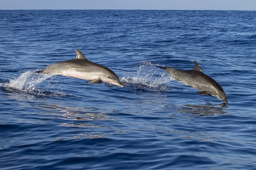
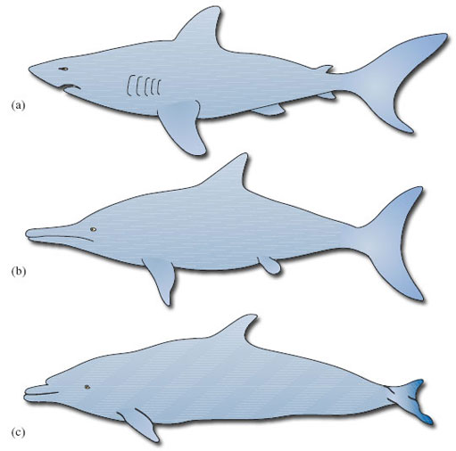
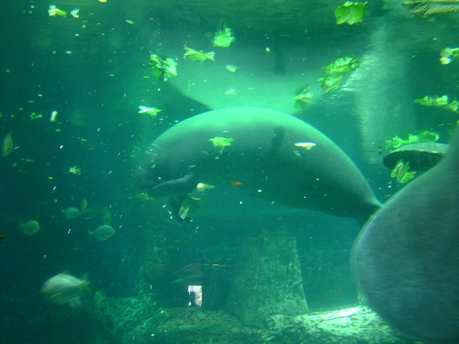
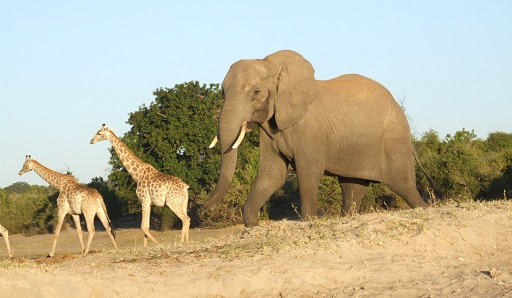
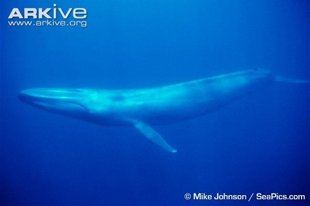

# 2 Living in the water

This section will begin by examining the physiology of mammals, and looking at the differences between those who live on land and those in the water. You will see how the how the bodies and behaviour of aquatic mammals have adapted to tackle the challenges of an aquatic environment.

## 2.1 Land versus water

Mammals share a number of biological characteristics that mark them out as members of the class Mammalia. Many of these are adaptations to a life on land. For example:

* 
Mammals give birth to young at a relatively advanced stage of development and feed their young on milk.

* 
Most mammals have hair, or fur, covering part or all of the body.

* 
Mammals have a high metabolic rate and maintain a relatively high body temperature, irrespective of the temperature of their environment.

* 
Most land mammals walk or run with a leg at each corner – a limb pattern they share with most other land vertebrates, including reptiles (except snakes and legless lizards) and most amphibians.

* 
Mammals breathe air and have a four-chambered heart, allowing them to split their circulation into a system for passing blood through the lungs and a system for transporting oxygen-rich blood around the body.

Almost all mammals can swim to some extent – even bats – and many make their way into the water from time to time for one reason or another.

### Activity 3 Mammals in water
__Timing: Allow about 5 minutes__

#### Question

Figure 4 A sequence of photos of an African elephant crossing a river

Figure 4 is a series of photos that show an African elephant crossing a river and snorkelling using its trunk. Study the photos and make notes about what might tempt any land-dwelling mammal into the water in the first place, and the main challenges it would face in the new environment.

#### Answer

The obvious attraction for many would be food, but other mammals might take to the water to escape from predators, pests or extremes of temperature. The elephant is a land mammal, but it enters the water to drink or bathe and as you have seen, it can swim across open water using its trunk as a snorkel.

The main challenges for a mammal moving into water would be: holding its breath long enough to find and catch its food; moving about in the strong current; and staying warm in the water. A good example would be the sea otter, which holds its breath while it uses webbed feet and a rudder-like tail to search for food in shallow coastal waters, its thick fur keeping it warm enough to live in Alaskan seas.

### The evolution of elephants

There are features of elephant anatomy that suggest that they might have adopted a semi-aquatic way of life at some point in their evolutionary history. The lungs of modern elephants are surrounded by loose connective tissue, not the bag-like ‘pleural cavity’ found in other land mammals, and this allows them to resist some of the damaging effects of water pressure. In addition, the kidneys of elephant foetuses possess features that are common in aquatic mammals but not land mammals. If the theory is true, the ancestors of today’s elephants must have moved into the water and then returned to the land, while their sirenian cousins went on to become fully aquatic.

You might have thought of other examples of aquatic mammals, but they all commonly face the same challenges. They are the result of matching their mammalian characteristics against a number of differences in the physical properties of air and water, the most important of which are listed below.

* 
Water contains less oxygen than air does.

* 
Water is denser and more viscous than air.

* 
Water has a higher specific heat and a higher thermal conductivity than air (you will meet these terms later in Section 2.4).

* 
Light is much more readily absorbed by water than by air, and visibility in water is often poor because suspended particles make it turbid.

* 
Sound travels faster and further in water than it does in air.

## 2.2 Breathing air

A swimming elephant can breathe by holding the end of its trunk out of the water, but if it tried to find its food under the surface, it would have to hold its breath. Neither the mammalian lung nor the skin can extract enough oxygen from water to sustain life, so fully aquatic mammals must come to the surface at intervals to breathe. All of them – pinnipeds, sirenians and cetaceans – are at risk of drowning if they are prevented from doing so for prolonged periods.

Lungs form 7% of the body mass of a human being, but no more than 3% of the body mass of most cetaceans – so lung size alone cannot account for their diving abilities. Part of the secret is that aquatic mammals use their lungs more efficiently: they extract more oxygen from the air they take in, and change a higher proportion of the air within their lungs with every breath. For example, we take in about a litre of air with each breath, despite the fact that our lungs can hold over four litres; a fin whale takes in 3000 times that amount in just under two seconds.

It is the ability to fill and empty their lungs so quickly that produces the ‘blow’ of the larger whales – something so distinctive that it can be used to identify species, even individual whales, far out at sea. The animals pay a price for this efficiency, however. We can obtain extra oxygen by taking deeper breaths; a whale can only breathe more frequently. Whaling ships used to take full advantage of this fact, chasing whales until the exhausted animals were forced to spend more and more time at the surface.

The need to breathe air means that sirenians and cetaceans have to be able to sleep without drowning, as these animals never leave the water. The blowhole in cetaceans seems to be under voluntary control, which suggests that these animals have to be ‘awake’ to breathe. From time to time, whales and dolphins rest at the surface of the water or close to it, and animals in social groups spend periods swimming slowly side by side (‘echelon swimming’). This paired swimming mimics the behaviour of a calf with its mother and is probably associated with rest. It is likely that at these times the animals use a form of ‘cat-napping’, in which one half of the brain rests while the other remains active.

## 2.3 Moving about

Water is more viscous than air, so it can take more effort to move through water (try running in a swimming pool). Friction between the body and the water causes turbulence, which holds a swimmer back, and the faster the swimmer tries to move, the greater the turbulence. One way of avoiding the problem is to leave the water for short periods and travel through air, and some of the smaller pinnipeds and cetaceans resort to ‘porpoising’ – leaping from the water for short periods when they need to move as quickly as possible. But to catch their food, these animals have to be swift and agile in the water.

Figure 5 Two dolphins porpoising

As pinnipeds breed on land (or ice), they have to be able to move around there as well. They have four flippers arranged in the typical mammalian limb pattern: two at the front and two at the back. In true seals, the hind flippers project behind the body and provide extra propulsion in association with a sideways swimming motion. The shorter front flippers are used for steering in the water and for pulling the body along on land. 

Figure 6 (a) Sea lions, *Zalophus wollebaeki*; (b) Fur seal, *Arctocephalus galapagoensis*

Fur seals and sea lions use longer front flippers to ‘fly’ through the water. Their hind flippers are mainly for steering, and most of the power comes from the body muscles and spine. On land, however, the hind flippers can be brought forward beneath the body, allowing the animal to lift itself up and ‘walk’.

Sirenians and cetaceans are fully aquatic and never leave the water. They swim in a rather different manner, using an up and down motion of a tail with horizontal flukes. The front fins help with steering and keep the animal stable in the water. This vertical swimming motion is another legacy of the animals’ terrestrial ancestry: imagine how the spine of a sprinting cheetah (or a galloping horse) flexes to allow the animal to increase its stride length.

The muscles of aquatic mammals are no stronger per unit of mass than the muscles of terrestrial mammals, so a dolphin’s top swimming speed of around 50 km h−1 is not the result of muscle strength alone. Most aquatic mammals are streamlined to some extent to help them slip through the water: having a smooth, cigar-shaped body with few external projections reduces water resistance and the drag created by turbulence. Streamlining is so important for aquatic animals that many fish, aquatic reptiles such as the extinct ichthyosaur, and aquatic mammals share a common body shape – an example of convergent evolution (see Figure 7). The streamlining of cetaceans is made even more effective by a special property of their skin. The outer layer is soft and spongy, and reduces turbulence at the skin–water interface by expanding and contracting in response to the flow of water.

Figure 7 The streamlined bodies of (a) a shark, (b) an ichthyosaur (an extinct marine reptile) and (c) a dolphin

These adaptations are so effective that it is now believed that cetacean swimming is almost as cost-effective (in terms of metabolic energy expended for distance travelled) as the running of land animals. Swimming at the surface is less efficient, however, as is the swimming of semi-aquatic mammals such as otters. It appears that economic running and swimming are difficult to combine in the same animal.

## 2.4 Staying warm …

Water has a higher specific heat than air: that is, it takes more energy to raise the temperature of a particular volume of water than it does to raise the temperature of the same volume of air by the same amount. One consequence of this is that the temperature of surface water tends to fluctuate within a smaller range than air temperature: from −1.9 °C (the freezing temperature of seawater) near the poles to an extreme of about 30 °C in the tropics. But deep water is always cold, whatever the location in the ocean; below about 1000 m, the temperature is uniformly cold, about 3-4 °C. The risks of heat loss from an aquatic mammal are all the greater because water has a relatively high thermal conductivity, so a warmer object loses heat fairly quickly when immersed. Think of thermal conductivity simply as a measure of how readily heat flows from a particular material. Marine mammals, like many of the larger land mammals, maintain their body temperature somewhere between 35 °C and 38 °C, so they all face the problem of staying warm in a colder environment.

This section explained the term ‘thermal conductivity’ above as ‘a measure of how readily heat flows from a particular material’. In a course of this level and duration, there will not be a detailed explanation of how it is measured, or its actual values and units. You may like to do your own further research to learn more about this area.

To put this into context, consider the Weddell seal of Antarctica. It maintains an internal temperature of 37 °C, despite water temperatures of around 0 °C and air temperatures of 0 °C to −50 °C (with a wind chill down to −100 °C or so). The newborn pup is protected from the cold by a dense layer of fur called ‘lanugo’. In the first month or so of life, as it prepares to go to sea, the pup replaces its lanugo with the shorter, sparser hair of the adult seal and develops a thick layer of blubber.

Figure 8 Weddell seal and pup, sourced from [CoolAntarctica.com](https://www.coolantarctica.com/)

<!--SAQ id=saq001-->

### Question 2
__Timing: Allow about 5 minutes__

#### Question

Can you think of a likely explanation for this change?

#### Answer

Blubber provides better insulation in the water (and the smoother coat of the adult improves its streamlining).
<!--ENDSAQ-->
A fur coat traps a layer of warm air next to the body and is a fairly good insulator in air and water, but it has its limitations. It requires a lot of maintenance, and water pressure squeezes out the air if the animal travels too far below the surface. (It is the still air trapped by fur that provides the insulation; a trapped layer of water in fur would provide some insulation, but not nearly as much as that offered by air.) Otters and fur seals make relatively modest dives, but many cetaceans and true seals, like the Weddell seal, hunt in deeper, colder waters.

Animals that dive to any great depth stay warm using blubber, a thick layer of fatty tissue that extends far beneath the skin. In air, blubber provides less insulation than an equal thickness of fur, but it retains much of its effectiveness in water and the extra bulk is less important in the more supportive medium. You’ll appreciate the fact that the relatively high density of the surrounding water helps ‘buoy up’ aquatic animals, such that diving mammals weigh relatively little in water.

Figure 9 A countercurrent heat exchange system. (a) Schematic representation. (b) Blood supply to the flipper of the dolphin, with a schematic cross-section of an artery and the surrounding veins to the left. Arterial blood is shown in red, venous blood in blue. Pink arrows denote heat flow; yellow arrows show direction of blood flow

Those parts of the animal not covered in blubber – the limbs and parts of the head – have another device for retaining heat: a countercurrent heat exchange system. In Figure 9(a), the outgoing (i.e. arterial) blood is shown to the left, on its way to the skin surface. But en route, such vessels run very close to a network of veins that are bringing cool, venous blood back into the body (shown to the right in Figure 9(a). Given the proximity of the (warm) outgoing and (cooler) incoming bloods, heat (which would otherwise be lost through the skin) is taken up by the cooler returning blood and carried back inside the animal. The red arrows in Figure 9(a) show the direction of heat flow; there is comparatively little heat loss from the skin. If you think about it, the system depends on outgoing and incoming blood flowing in *opposite* directions, which is why it is called countercurrent heat exchange. If the two blood flows were in the *same* direction, there would cease to be any heat transfer once the blood temperatures had become identical.

The system is shown to best effect in the flippers (and tails) of diving mammals, which have to be thin, and therefore free of insulating blubber, if they are to function effectively. Efficient heat exchange at such sites is essential if heat loss is to be avoided. Figure 9(b) shows the close juxtaposition of the arterial and venous bloods, with the central artery and surrounding veins in cross-section.

Fur and blubber are such effective insulators that some aquatic mammals can find themselves with another problem: losing excess heat after exercise, especially in sunny conditions. Blubber is full of small blood vessels which dilate to bring warm blood close to the skin, allowing a certain amount of active temperature regulation. The countercurrent system has its own control mechanism. A rise in blood pressure with activity causes the arterial walls to expand, which closes the network of veins bringing cool blood back inside. The warm blood then passes straight through to the skin, excess heat is lost to the external environment, and the cool blood has to find another (non-countercurrent) route back to the heart.

## 2.5 … and getting larger

Size offers a number of biological advantages, including some protection from predation, but it can also help in reducing heat loss. A large mammal has a large body mass (which generates heat) relative to its surface area (which loses heat). But there will be constraints on any evolutionary trend of increasing body mass in some aquatic mammals. Seals, sea lions and toothed whales have to remain agile enough to chase their prey, and the pinnipeds as a whole have to be able to move about on land, but they are all still fairly large animals.

Manatees live in relatively warm waters. Their metabolic rate is comparatively low and they normally expend relatively little energy on keeping their body temperature constant. Their large size (up to 590 kilos and 4 m in length) helps conserve body heat but they are very vulnerable to cold water, below about 15 °C.

Figure 10 Manatee

The baleen whales, however, feed by filtering fish or invertebrates as they cruise the colder oceans of the world. As their prey is not chased, and their bodies are well supported by the density of the water, over the many millions of years of their evolution they have grown to immense sizes. The blue whale is the largest animal that has ever lived, a point that the following images will demonstrate.

Figure 11 The african elephant is the largest terrestrial mammal, at around 6 tonnes

Figure 12 The blue whale, at up to 150 tonnes, is the largest animal that has ever existed

Figure 13 This comparative image then demonstrates the immense size of the blue whale, when shown to scale against the elephant, and a variety of other mammals

## 2.6 Senses and communication …

Light travels only a few hundred metres through clear water, so sight is of limited use to animals hunting in deeper waters.

Seals use their eyes and sensory whiskers to search for food in relatively shallow water. Elephant seals feed at depths of 300–700 m and have eyes that adapt to poor light faster than those of any mammal tested; some six minutes compared with 20 minutes for the human eye. Despite this capacity, vision is probably of little use at the bottom of their feeding range and they must rely on sensitive whiskers and hearing. In fact, the whiskers of seals and sea lions are so important that a special blood supply at their bases keeps them warm and flexible even in the deepest, coldest waters.

Eyesight is certainly of some use in making sense of the immediate environment, and sirenians need little else to find their food in shallow, clear waters. But when hunting at depth, as many toothed whales do, communication using sound is generally a better option. Sound travels five times faster in water than it does in air, and the toothed whales use a range of high-frequency squeaks, whistles and moans to communicate with each other and coordinate social behaviour, such as the coordinated driving of fish by a pod of bottlenose dolphins, which you will find more about in Section 2.7.

You’ll also be aware that dolphins (and many other toothed whales) use a sophisticated echolocation system – ‘seeing with sound’ – to make sense of their environment and detect prey.

Figure 14 The generation and reception of sound in the head of a dolphin. The melon acts as an acoustic lens, focusing the clicks, while the oil-filled cavity of the lower jaw acts as an acoustic pipe, conducting sound to the ear

Dolphins produce a range of high-frequency clicks using air passages around the blow-hole (you can find many videos of dolphin clicks on youtube. This is one example of a [video about how dolphin sounds work, with example audio](https://www.youtube.com/watch?v=d6798extvoU)). These clicks are focused by the front of the skull, which is shaped like a satellite dish, and pass out into the water through a waxy structure, the ‘melon’, which acts as an acoustic lens. In this way, the animal can focus and direct the stream of sound. The returning pulses are picked up by oil-filled cavities in the lower jaw and pass through to the inner ear, which is enclosed in a bone casing called the auditory bulla (Figure 14). This bone casing itself is surrounded by a mucus foam to isolate it from other vibrations. The whole system is sensitive enough to allow the animals to determine the size, shape and distance – even the internal structure – of objects as much as 800 m away. It is also powerful enough to allow them to stun, or even kill, their prey with a well directed burst of sound.

As well as travelling faster in water, sound also travels further and with less distortion than in air. The other suborder of cetaceans – the baleen whales – utilise this property in their use of low-frequency calls produced from the vocal cords to communicate with each other across the oceans. The song of the humpback whale is perhaps the best-known example. The song differs from population to population, and individual to individual, and it develops over time as the whales imitate each other and introduce variations. The whales also exploit a special property of the oceans to make themselves heard over great distances. At a depth of around 1000 m, there is a band of water in which temperature and pressure combine to reduce the speed of sound to a minimum. The low-frequency song of the whales can spread out through this ‘sound channel’ for distances of up to 1000 km, with little loss of energy to the water surrounding the channel.

Recent research on harbour seals and killer whales in the northeastern Pacific illustrates the sophistication of the sound world of marine mammals. The seals largely ignore a resident population of fish-eating killer whales, which use frequent echolocation clicks and communication calls. From time to time, however, the area is visited by transient pods of mammal-eating killer whales. These animals use few vocalisations, presumably to avoid alerting the seals, but the seals have learned to recognise the sounds that they do make and take evasive action.

### Activity 4 Whale vocalisations
__Timing: Allow about 10 minutes__

#### Question

To round off this section on senses and communication, the activity introduces you to some whale vocalisations and their possible function, or functions.

Now listen to the clicks produced by sperm whales at depth. The clicks are used for echolocation but might also be loud enough to ‘stun’ squid at close range. The clicks also have a social function. In the background, you can hear the high-pitched sounds of dolphins:
<!--MEDIACONTENT-->

Audio 1 Sperm whale clicks

<!--ENDMEDIACONTENT-->
Humpback whales produce a wide range of sounds that are very complex and often produced for long sessions of several hours. Listen to a short clip and marvel at the structure of the ‘song’:
<!--MEDIACONTENT-->

Audio 2 Humpback whale song

<!--ENDMEDIACONTENT-->
Hal Whitehead from the Department of Biology at Dalhousie University in Nova Scotia has a special interest in the social structure and cultural life of sperm whales, as he told the BBC’s Julian Hector:
<!--MEDIACONTENT-->

Audio 3 Hal Whitehead interview

<!--TRANSCRIPT--><table xmlns:str="http://exslt.org/strings" border="1"><tr><td>
__HAL WHITEHEAD:__ *The best evidence is-- for sperm whales and for most whales and dolphins, comes from their sounds. Sounds are very important in the ocean, they travel very well, much better than light or smell or anything like that, and we can record the sounds much more easily than we can see the animals. And so we've been able to listen to the sounds that the different whales and groups of whales are making, and to chart those patterns, and when we do this, we find patterns which don't make sense, just from the basis of genes controlling these things. So, it's clear that the whales are learning their vocabulary, the sounds they make, from each other. Off the Galápagos, where I've done a lot of work, there are two very distinct clans of sperm whales, and one make patterns of clicks like 'Click click click click' or 'click click click click click'. We call them the 'regular clan'. And then there's another clan who live in the same waters, who go 'Click click click, click' or 'Click click click click, click.' We call them the 'plus one' clan. So they have these different ways of vocalizing, but there's much more to it than that. The different social units form groups, they get together and work together for periods of days. They only do this with members of their own clan. The different clans have distinctive ways of moving around the islands. They have different feeding success. In normal years, when the waters are quite cool off the Galápagos, then the regular clan does better. But when they warm up, you get El Niño coming in, then it's reversed, and everyone does badly, but now it's the plus one clan who are doing better. So it seems that these clans, which we – and probably the whales themselves – identify primarily through these sounds, their culture is a very important part of what they do, how they are and how they interact with the rest of the world.*;

__JULIAN HECTOR:__ *If they're relying a lot on information being handed from one individual to another, and they can even share information from one distant group to another, depending what the year is, what impact does hunting on those populations have, if those groups are disrupted?*;

__HAL WHITEHEAD:__ *The first idea is that there may be particular animals, and probably in particular older females, who have very important sets of knowledge, and as things in the ocean are varying over long timescales, the older animals' knowledge becomes particularly important, because they've been through a lot of the variations which happen very rarely. So, especially if you lose a lot of the older animals in your society, it can really affect the ones who are left. And we have indications of that in the Eastern Pacific, where the whaling between about the 1950s and the early 1980s was particularly intense, and there it's likely there aren't that many very older animals, and we find less success in raising calves than say, in the Western Atlantic where there wasn't that modern whaling. So that's one level of it, and another level is that, if you get a population down to very small size, then not only do you lose genes, genetic diversity, but you lose cultural diversity, so, some of the knowledge that has been important for that species may be lost, just because there's so few animals left, and those that are left have either forgotten or not learned that particular knowledge. So for instance, the right whales in the North Atlantic and North Pacific, which have been brought down to probably tens of animals, seem not to use many of the areas that traditionally they did use, and so in some ways perhaps they've lost important cultural knowledge of how to use their environment.*;

__JULIAN HECTOR:__ *So in your view, Hal, is this an argument to ban whaling or to limit whaling?*;

__HAL WHITEHEAD:__ *I think it's an argument to ban whaling, as well as possibly to limit whaling in some cases. I think the third argument which I didn't make then is the idea that, the culture is a good marker of these other cognitive traits, that are characteristic obviously of humans, but of a very few other animals which we're beginning to think maybe we should give special rights to. So I think we need to think about that –  these are difficult issues, but if we're going to give special rights to chimpanzees, we're not going to chop them up for meat, then I think the same arguments hold for whales, and we shouldn't be doing the same for them.*;
</td></tr></table><!--ENDTRANSCRIPT--><!--ENDMEDIACONTENT-->
You can listen to recordings of lots of other whale species online (on [Wikipedia](https://en.wikipedia.org/wiki/Whale_vocalization#Media) for example).

## 2.7 … and becoming more intelligent

Intelligence is a useful commodity: it can help an animal to make sense of its environment and cope with the demands of social behaviour such as courtship and competition. Hunters tend to be relatively intelligent, and otters, pinnipeds and cetaceans, for example, share a playful curiosity that is characteristic of animals that catch other animals in order to survive. Some especially extravagant claims have been made for the intelligence of the toothed whales, largely because these animals use communication and cooperation to maximise the efficiency of their hunting behaviour.

### Activity 5 Intelligent behaviour?
__Timing: Allow about 10 minutes__

#### Question

Watch the video clip, which shows the hunting behaviour of bottlenose dolphins. Note down any aspects of the animals’ behaviour that strike you as intelligent.

Before you watch, it might be an idea to spend a few minutes thinking about what ‘intelligent’ means. But be warned, it’s by no means an easy concept to pin down.
<!--MEDIACONTENT--><video xmlns:str="http://exslt.org/strings" width="80%" download=""><source src="https://www.open.edu/openlearn/ocw/pluginfile.php/1289478/mod_oucontent/oucontent/65779/s182_11_video_3_arkive_hunting_behaviour_dolphins.mp4" type="video/mp4"></source></video>

Video 3 Hunting behaviour of dolphins

<!--ENDMEDIACONTENT-->

#### Answer

You may have noted the following points:

* 
Strategy and tactics: the dolphins identify a suitable target (a shoal of fish) and plan ahead (edging the shoal close to the bank or the surface of the water).

* 
Teamwork and cooperation: working together to achieve a common goal.

* 
The use of communication to coordinate behaviour.

* 
The adoption of specific roles within the group (the ‘spy-hopper’, for example).

* 
The use of judgement to select the right option at the right time.

Some of the words you probably noted down certainly imply intelligence – ‘planning’, ‘communication’, ‘judgement’ – but it is difficult to define or measure intelligence in ourselves, let alone other animals. The behaviour of the dolphins certainly seems as sophisticated as the hunting strategies of lions or African hunting dogs, for example, but is there any evidence that they are more intelligent than that?

Well, cetaceans have large brains relative to body size, with folds in the part of the brain responsible for complex functions – the cerebral cortex – that are reminiscent of those in primates. They use sound in a number of sophisticated ways and engage in subtle social interactions that may be mediated by a simple form of ‘language’. Dolphins can be trained to respond to commands and perform tricks – and they can develop and vary these routines and imitate each other’s behaviour. On the other hand, the large brain and the folding of the cerebral cortex may be simply a function of the size of these animals, or a consequence of the need to produce and process such complex sounds. And many other animals can be trained to perform tricks, including pigeons and other species not generally regarded as particularly bright.

One behaviour that has caused some people to question the intelligence of cetaceans is a tendency to strand themselves in large numbers on beaches and, even more puzzling, to strand themselves again if they are helped back into the water. The reasons for this phenomenon are poorly understood. It could be a response to distress calls, a form of mass panic, or the result of damage to the echolocation system caused by disease, parasites or pollution. As with so many aspects of cetacean behaviour, the honest answer is that we just don’t know.

One difficulty in interpreting cetacean behaviour may be our tendency to describe and discuss intelligence in terms of the way we, as humans, interact with each other and our surroundings. The arrogance of attempting to judge the intelligence of other species by our own standards was used to comic effect by Douglas Adams in *The Hitchhiker's Guide to the Galaxy*.

<!--Quote id=quo001_001-->
>It is an important and popular fact that things are not always what they seem. For instance, on the planet Earth, man had always assumed that he was more intelligent than the dolphins because he had achieved so much - the wheel, New York, wars and so on - whilst all the dolphins had ever done was muck about in the water having a good time. But conversely, the dolphins had always believed that they were far more intelligent than man - for precisely the same reasons.
>(Adams, 1979, p.132)

