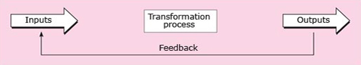
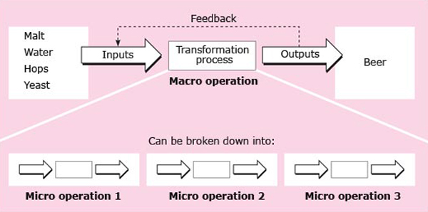

# 3 The transformation model

## 3.1 The transformation model

The discussion above has highlighted the role of operations in creating and delivering the goods and services produced by an organisation for its customers. This section introduces the transformation model for analysing operations. This is shown in <a xmlns:str="http://exslt.org/strings" href="">Figure 1</a>, which represents the three components of operations: inputs, transformation processes and outputs. Operations management involves the systematic direction and control of the processes that transform resources (inputs) into finished goods or services for customers or clients (outputs). This basic transformation model applies equally in manufacturing and service organisations and in both the private and not-for-profit sectors.

 Figure 1 The transformation model

Let's look at each of the components of <a xmlns:str="http://exslt.org/strings" href="">Figure 1</a> in a little more detail.

## 3.2 Inputs

Some inputs are used up in the process of creating goods or services; others play a part in the creation process but are not used up. To distinguish between these, input resources are usually classified as:

* 
transformed resources – those that are transformed in some way by the operation to produce the goods or services that are its outputs

* 
transforming resources – those that are used to perform the transformation process.

Inputs include different types of both transformed and transforming resources.

Three types of resource that may be transformed in operations are:

* 
materials – the physical inputs to the process

* 
information that is being processed or used in the process

* 
customers – the people who are transformed in some way.

Many people think of operations as being mainly about the transformation of materials or components into finished products, as when limestone and sand are transformed into glass or an automobile is assembled from its various parts. But all organisations that produce goods or services transform resources: many are concerned mainly with the transformation of information (for example, consultancy firms or accountants) or the transformation of customers (for example, hairdressing or hospitals).

Galloway (1998) defines operations as all the activities concerned with the transformation of materials, information or customers.

The two types of transforming resource are:

* 
staff – the people involved directly in the transformation process or supporting it

* 
facilities – land, buildings, machines and equipment.

The staff involved in the transformation process may include both people who are directly employed by the organisation and those contracted to supply services to it. They are sometimes described as ‘labour’. The facilities of an organisation – including buildings, machinery and equipment – are sometimes referred to as ‘capital’. Operations vary greatly in the mix of labour and capital that make up their inputs. Highly automated operations depend largely on capital; others rely mainly on labour.

### Activity 4

#### Question

Identify the principal inputs (both transformed and transforming resources) used by each of the following organisations, and their principal outputs.
<table xmlns:str="http://exslt.org/strings">
<caption></caption>
<tbody>
<tr>
<th>Organisation</th>
<th>Inputs</th>
<th>Outputs</th>
</tr>
<tr>
<td class="highlight_" rowspan="" colspan="">Restaurant</td>
<td class="highlight_" rowspan="" colspan=""></td>
<td class="highlight_" rowspan="" colspan=""></td>
</tr>
<tr>
<td class="highlight_" rowspan="" colspan="">University</td>
<td class="highlight_" rowspan="" colspan=""></td>
<td class="highlight_" rowspan="" colspan=""></td>
</tr>
<tr>
<td class="highlight_" rowspan="" colspan="">Doctor's surgery</td>
<td class="highlight_" rowspan="" colspan=""></td>
<td class="highlight_" rowspan="" colspan=""></td>
</tr>
<tr>
<td class="highlight_" rowspan="" colspan="">Nuclear fuel reprocessing plant</td>
<td class="highlight_" rowspan="" colspan=""></td>
<td class="highlight_" rowspan="" colspan=""></td>
</tr>
</tbody>
Reference: 

</table>

#### Discussion

The transformed resources of a restaurant include food and drink, and its transforming resources include equipment such as cookers, refrigerators, tables and chairs, and the chefs and waiters. In a university, the transformed resources include students and knowledge and the transforming resources include lecturers, tutors and support staff, as well as classrooms, books and instructional materials.

## 3.3 Outputs

The principal outputs of a doctor's surgery are cured patients; the outputs of a nuclear reprocessing plant include reprocessed fuel and nuclear waste. Many transformation processes produce both goods and services. For example, a restaurant provides a service, but also produces goods such as food and drinks.

Transformation processes may result in some undesirable outputs (such as nuclear waste in the example above) as well as the goods and services they are designed to deliver. An important aspect of operations management in some organisations is minimising the environmental impact of waste over the entire life cycle of their products, up to the point of final disposal. Protecting the health and safety of employees and of the local community is thus also the responsibility of operations management. In addition, the operations function may be responsible for ethical behaviour in relation to the social impact of transformation processes, both locally and globally. For example, in the United States, manufacturers of sports footwear have come under fire for employing child labour and paying low wages to workers employed in their overseas factories.

## 3.4 Transformation processes

A transformation process is any activity or group of activities that takes one or more inputs, transforms and adds value to them, and provides outputs for customers or clients. Where the inputs are raw materials, it is relatively easy to identify the transformation involved, as when milk is transformed into cheese and butter. Where the inputs are information or people, the nature of the transformation may be less obvious. For example, a hospital transforms ill patients (the input) into healthy patients (the output).

Transformation processes include:

* 
changes in the physical characteristics of materials or customers

* 
changes in the location of materials, information or customers

* 
changes in the ownership of materials or information

* 
storage or accommodation of materials, information or customers

* 
changes in the purpose or form of information

* 
changes in the physiological or psychological state of customers.

Often all three types of input – materials, information and customers – are transformed by the same organisation. For example, withdrawing money from a bank account involves information about the customer's account, materials such as cheques and currency, and the customer. Treating a patient in hospital involves not only the ‘customer's’ state of health, but also any materials used in treatment and information about the patient.

One useful way of categorising different types of transformation is into:

* 
manufacture – the physical creation of products (for example cars)

* 
transport – the movement of materials or customers (for example a taxi service)

* 
supply – change in ownership of goods (for example in retailing)

* 
service – the treatment of customers or the storage of materials (for example hospital wards, warehouses).

Several different transformations are usually required to produce a good or service. The overall transformation can be described as the macro operation, and the more detailed transformations within this macro operation as micro operations. For example, the macro operation in a brewery is making beer (<a xmlns:str="http://exslt.org/strings" href="">Figure 2</a>). The micro operations include:

* 
milling the malted barley into grist

* 
mixing the grist with hot water to form wort

* 
cooling the wort and transferring it to the fermentation vessel

* 
adding yeast to the wort and fermenting the liquid into beer

* 
filtering the beer to remove the spent yeast

* 
decanting the beer into casks or bottles.

Figure 2 Macro and micro operations

### Activity 5

#### Question

Identify the principal resources (inputs), the type of transformation process and the principal outputs (goods or services) in each of the following operations.
<table xmlns:str="http://exslt.org/strings">
<caption></caption>
<tbody>
<tr>
<th></th>
<th>Inputs</th>
<th>Type of transformation</th>
<th>Outputs</th>
</tr>
<tr>
<td class="highlight_" rowspan="" colspan="">Refining steel</td>
<td class="highlight_" rowspan="" colspan=""></td>
<td class="highlight_" rowspan="" colspan=""></td>
<td class="highlight_" rowspan="" colspan=""></td>
</tr>
<tr>
<td class="highlight_" rowspan="" colspan="">Assembling cars</td>
<td class="highlight_" rowspan="" colspan=""></td>
<td class="highlight_" rowspan="" colspan=""></td>
<td class="highlight_" rowspan="" colspan=""></td>
</tr>
<tr>
<td class="highlight_" rowspan="" colspan="">Delivering cars to dealers</td>
<td class="highlight_" rowspan="" colspan=""></td>
<td class="highlight_" rowspan="" colspan=""></td>
<td class="highlight_" rowspan="" colspan=""></td>
</tr>
<tr>
<td class="highlight_" rowspan="" colspan="">Repairing cars</td>
<td class="highlight_" rowspan="" colspan=""></td>
<td class="highlight_" rowspan="" colspan=""></td>
<td class="highlight_" rowspan="" colspan=""></td>
</tr>
<tr>
<td class="highlight_" rowspan="" colspan="">Designing cars</td>
<td class="highlight_" rowspan="" colspan=""></td>
<td class="highlight_" rowspan="" colspan=""></td>
<td class="highlight_" rowspan="" colspan=""></td>
</tr>
</tbody>
Reference: 

</table>

#### Discussion

You may have identified various inputs such as materials, energy, machines, equipment, buildings and people. For example, the inputs used by a car assembly plant include components, equipment, buildings, labour and energy. You may also have included less tangible inputs to the transformation process, such as information and skills.

You might have noticed that, midway down the list, the activities changed from primarily the production of goods to the provision of services. In the case of car designing, the principal inputs are ideas and the outputs are materials used to communicate the finished idea, such as blueprints or computer models.

## 3.5 Feedback

A further component of the transformation model in Figure 1 is the feedback loop. Feedback information is used to control the operations system, by adjusting the inputs and transformation processes that are used to achieve desired outputs. For example, a chef relies on a flow of information from the customer, through the waiter, about the quality of the food. Adverse feedback might lead the chef to change the inputs (for example by buying better quality potatoes) or the transformation process (for example by changing the recipe or the cooking method).

Feedback is essential for operations managers. It can come from both internal and external sources. Internal sources include testing, evaluation and continuously improving goods and services; external sources include those who supply products or services to end-customers as well as feedback from customers themselves.

