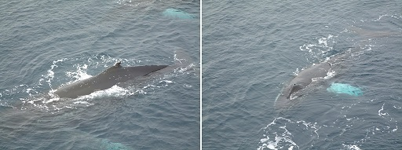

# 4 The evolution of whales

Now that you have examined the challenges facing all aquatic mammals, it is interesting to consider the evolutionary pathway followed by them. There isn’t space in this short course to look at all the groups in detail. So, as a brief example, this section will explore what is known about the evolutionary history of the cetaceans.

Figure 17 Humpback whales

## 4.1 The rate of evolution

The cetaceans have travelled furthest from their terrestrial roots and made the fullest adaptation to life in the sea. Since mammals evolved on land, it has long seemed reasonable to suggest that the origin of whales must have involved an evolutionary transition from the land to the water. But how can we explain the fact that living whales are so well adapted to a life in the water, and so far removed in form and behaviour from most other mammals? There are two main problems. First, if evolution proceeds through the build-up of numerous small changes, it is difficult to see how the wide gap between terrestrial mammals and whales could have been bridged – even given the enormous amounts of time involved. Second, there is the problem of ‘intermediate forms’: that is, the nature of the animals that must have filled the gap.

In the 1930s, the American biologist George Gaylord Simpson noted something interesting about the apparent rate of evolutionary change in whales. He examined the fossils of some primitive whales, which had been dated back to the Eocene (about 50 million years ago), and compared the anatomy of these early proto-whales with the anatomy of their living descendants. Eldredge describes Simpson's work:

<!--Quote id=quo001_002-->
>One can measure the average rate of evolution for various anatomical features in the 50 million years it took to modify [primitive] Eocene whales into fully modern forms. Let us then take that measured rate of evolution within whales and calculate how long it would have taken for Eocene whales to evolve from terrestrial ancestors. Extrapolating back, it would have taken at least 100 million years (possibly even considerably more) for the transition from terrestrial ancestor to aquatic, primitive whale descendant to have occurred - assuming, that is, that whales evolved from terrestrial ancestors at the same rate of evolution we see in the 50 million years that elapsed between Eocene and modern whales.
>(Eldredge, 1991, p. 168)

This is a problem: 100 million years before the Eocene takes us back before the evolution of mammals as a group (let alone the first mammals to take to the water).
<!--SAQ id=saq005-->

### Question 6
__Timing: Allow about 5 minutes__

#### Question

Can you identify a possible solution to this problem? (Hint: think about the assumption noted in the quotation.)

#### Answer

Perhaps the rate of evolution was *not* the same for the transition from terrestrial ancestor to primitive Eocene whale as it was for the later transition from Eocene whale to modern whales.
<!--ENDSAQ-->
Simpson suggested that the rate of evolution had *not* been the same – that the large-scale transformations needed for a mammal to move from the land to water might have occurred more quickly than the subsequent ‘fine-tuning’ from primitive whale to modern whale. Some biologists see this as a general pattern, in which periods of rapid evolutionary change in small, isolated populations give rise to major new groups of animals, and are followed by longer periods of relative stability in which the rate of change to the new design is fairly modest. Niles Eldredge and the late Stephen Jay Gould have coined the term ‘punctuated equilibria’ for this controversial theory.

## 4.2 Intermediate forms

In essence, the argument about intermediate forms runs as follows. If whales evolved from a terrestrial ancestor through the accumulation of small differences over time, we should expect to find the fossils of a number of ‘missing links’, i.e. creatures with a mixture of terrestrial and aquatic characteristics. In fact, we might expect to find a succession of such animals, each a little bit more whale-like and a little bit less well adapted to life on land than its predecessor.

To make things more complicated, each of these intermediate forms must have been a fully working animal: it must have been able to breathe, to move about its environment, to feed itself and to reproduce. For a long time, biologists speculated about what these animals might have looked like. Surely at some point there must have been a creature that was at home on neither land nor sea, and so unable to compete with the animals already fully adapted to either habitat.

The problem of intermediate forms is by no means a new one. In *The Origin of Species*, published in 1859, Charles Darwin included a whole chapter on some of the difficulties facing his new theory. He started with the problem of intermediate forms:

<!--Quote id=quo004_002_001-->
>Firstly, why, if species have descended from other species by insensibly fine gradations, do we not everywhere see innumerable transitional forms?
>(Darwin, 1859, p. 130)

And a little later in the same chapter:

<!--Quote id=quo004_002_002-->
>It has been asked by the opponents of such views as I hold, how, for instance, a land carnivorous animal could have been converted into one with aquatic habits; for how could the animal in its transitional state have subsisted?
>(Darwin, 1859, p. 136)

Let’s examine Darwin’s questions one at a time. First, the scarcity of intermediate forms in the fossil record.
<!--SAQ id=saq006-->

### Question 7
__Timing: Allow about 5 minutes__

#### Question

What does the theory of ‘punctuated equilibria’ suggest about the chances of finding intermediate forms in the fossil record?

#### Answer

The theory suggests that we are more likely to find fossils of the animals that occupy the relatively stable periods (the ‘equilibria’) than we are to find the fossils of the animals that form part of the periods of rapid change, especially if that rapid change took place in small or isolated populations.
<!--ENDSAQ-->
Now let’s think about the nature of those animals.
<!--SAQ id=saq007-->

### Question 8
__Timing: Allow about 5 minutes__

#### Question

Can you think of any modern animals that are at home on land and in the water?

#### Answer

Otters are wonderful swimmers and can chase and catch fish, but they also move about well enough to hunt on land. Seals and sea lions are clearly most at home in the water, but they can still chase each other about on the breeding beaches. So it is possible to imagine an early ancestor of the whales leading a similarly amphibious existence.
<!--ENDSAQ-->
Studies of the chemical make-up of proteins (particularly antibodies) in present-day species have shown that modern whales are closely related to the artiodactyls, a group of hoofed mammals that includes cows, sheep, deer and hippos. For some 100 years after the publication of *The Origin of Species*, all the known fossils of early cetaceans were either clearly terrestrial animals or primitive whales like those examined by Simpson. But recent finds have included the remains of creatures that might have had a more amphibious existence. These animals also lived in the Eocene (55 to 34 million years ago), in or around the warm, shallow waters of the Tethys Sea, an ancient ocean that stretched from modern Spain to Indonesia.

Figure 18 Some representative mammals in the evolutionary history of modern whales. These are not drawn to scale (measurements refer to body length) and the dashed lines do not reflect direct descent. Shown here are imaginative reconstructions of the fossil species, suggesting how they might have looked in life

Figure 18 shows three representative animals in a postulated evolutionary sequence from an Eocene terrestrial ancestor to modern odontocetes and mysticetes.

*Pakicetus* is approximately 50 million years old. It lived by the side of shallow marine estuaries and was probably a wolf-sized ambush predator. It had long legs, an upright stance and may have spent much of its time running down small fish in the shallows.

*Ambulocetus* (‘walking whale’) is approximately 48 million years old, somewhere between *Pakicetus* and *Dorudon*. It was an amphibious animal with many of the characteristics we would expect in a transitional form. It could probably clamber about on land like a crocodile, but it was also a powerful swimmer, using its large feet and flexible spine like an otter. Intriguingly, it seems to have had a fluid-filled cavity linking its jaw and inner ear, similar to that found in modern dolphins (<a xmlns:str="http://exslt.org/strings" href="">Figure 14</a>), and it may have listened for the vibrations of approaching prey by resting its jaw on the ground – a strategy seen in today’s crocodiles.

*Dorudon* is somewhere between 40 and 36 million years old. This animal lived in warm, shallow seas, where it fed on small fish and molluscs. It was about 4.5 m long and, like modern cetaceans, fully committed to a life in the water.

The Eocene was followed by the Oligocene (34 to 24 million years ago). The Tethys Sea disappeared as India ploughed into Asia, and the early whales found themselves having to live in deeper, colder waters. It didn’t take them long, in evolutionary terms, to split into the two main lifestyles we see today. The toothed whales came to hunt fish and squid using high-frequency echolocation, while the baleen whales began to feed by filtering water, grew ever larger and sang their low-frequency songs across the oceans of the world.

