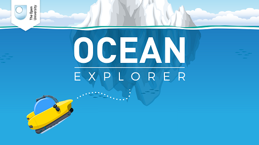

# Conclusion

This free course provided an introduction to studying aquatic mammals. You have now learned about a variety of aquatic mammals, their behaviours and their evolutionary history. The final section then introduced the ways in which humans have impacted the ecosystem.

The course activities were designed to help you to improve your confidence as an independent learner, and develop your approach to study and learning at a distance.

If you'd like to learn more about the oceans, visit our [Ocean Explorer](https://www.open.edu/openlearn/oceanexplorer) interactive, and take a look at some other free study materials on that page.

Ocean Explorer

To find out a bit more about aquatic life, you can download our [free Oceans poster](https://www.open.edu/openlearn/nature-environment/natural-history/download-your-free-oceans-poster) that accompanied Blue Planet, the OU/BBC TV series.

