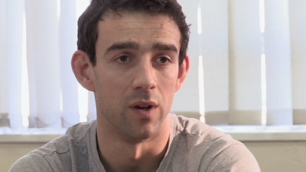

# 7 Grammar in the real world

In previous sections of this course you have seen how a functional understanding of grammar can apply to a wide range of contexts. In this section, you will see how a functional approach, and particularly SFL, is being applied in a professional context, in this case secondary education. Shortly, you will learn about the work going on in an inner-city school in Birmingham, UK, to use functional grammar to improve student learning and achievement in their school subjects such as PE and Science.

First of all, however, it will be useful to introduce a particular aspect of grammar called ‘nominalisation’. This has been identified by functional linguists as an important feature of academic and scientific language, but one that can make scientific texts hard for learners to understand and produce scientific writing. The term will be explained as you work through the activity.

### Activity 10: Raining cats and dogs 
__Timing: 15 minutes__

#### Question

Figure 11 Raining cats and dogs?

Compare these two short sentences and answer the following questions (note that the idiom ‘raining cats and dogs’ is used in British English to indicate heavy rainfall):

1. What context might you expect each to have been produced in?

2. What differences do you notice between the grammar patterns in each?

It got muggy really quickly and then it came down cats and dogs.

The rapid rise in humidity was followed by heavy precipitation.

#### Discussion

1. You may have commented that the first sentence is more likely to have come up in spontaneous, informal, face-to-face conversation, where someone is telling a personal story to someone they know quite well. The second describes a similar event but seems to come from a weather report or some other scientific record of the event, and was probably written rather than spoken.

2. There are a number of features you may have pointed out here. A key difference is in the way that information is packaged in each case. In the first sentence, a lot of the information is conveyed through the verb groups and adverb groups *got muggy really quickly* and *came down cats and dogs*, the noun groups are simple (e.g. made up of one pronoun) and there are two clauses linked by *and*. In the second, there is only one clause and one verb group *was followed*, which conveys information about the sequencing of events but not about what actually happened. Most information is instead conveyed through the noun groups *A rapid rise in humidity* and *heavy precipitation*. This can be shown as follows:
<table xmlns:str="http://exslt.org/strings">
<caption></caption>
<tbody>
<tr>
<th>Noun group</th>
<th>Verb group</th>
<th>Adverb group</th>
<th></th>
<th></th>
<th>Noun group</th>
<th>Verb group</th>
<th>Noun group</th>
</tr>
<tr>
<td class="highlight_" rowspan="" colspan="">It</td>
<td class="highlight_" rowspan="" colspan="">got muggy</td>
<td class="highlight_" rowspan="" colspan="">really quickly</td>
<td class="highlight_" rowspan="" colspan="">and</td>
<td class="highlight_" rowspan="" colspan="">then</td>
<td class="highlight_" rowspan="" colspan="">it</td>
<td class="highlight_" rowspan="" colspan="">came down</td>
<td class="highlight_" rowspan="" colspan="">cats and dogs.</td>
</tr>
</tbody>
</table>
<table xmlns:str="http://exslt.org/strings">
<caption></caption>
<tbody>
<tr>
<th>Noun group</th>
<th>Verb group</th>
<th>Prepositional group</th>
</tr>
<tr>
<td class="highlight_" rowspan="" colspan="">The rapid rise in humidity</td>
<td class="highlight_" rowspan="" colspan="">was followed</td>
<td class="highlight_" rowspan="" colspan="">by heavy precipitation.</td>
</tr>
</tbody>
</table>

A compression of information has been enabled by the nominalisations *humidity* and *precipitation*.

This feature often seen in scientific and academic texts is called nominalisation. You saw a good example of it in Activity 9. __Nouns__ and __noun groups__ can be used to package meanings about entities in the real world – things or persons like mangoes, bluebottles, windowpanes, schoolgirls and clouds (often called concrete nouns). However, we can also use __noun groups__ to talk about processes and qualities. If someone is leaving, for example, we can talk about their *departure*, and if they are feeling frustrated, we can talk about their *frustration*. *Departure* and *frustration* are both nouns, but they are not really ‘things’ in the way that a bluebottle or a windowpane is (they are often called abstract nouns). Nominalisation is the use of a noun to represent a process or quality. Through nominalisation, it becomes possible to pack into one noun group a number of meanings that might otherwise be expressed using __verb groups__ and __adverb groups__.

Figure 12 From concrete to abstract

This cartoon emphasises the fact that nominalisation can sometimes make language unnecessarily difficult and obscure. But in fact, without the ability to nominalise, i.e. to turn processes and qualities into nouns, it would be impossible to conceive of many common concepts such as ‘ownership’ or ‘movement’, or to measure abstract things such as ‘growth’, ‘birth rates’, etc. Below are some examples of processes in their verb form and their nominalised form.
<table xmlns:str="http://exslt.org/strings">
<caption>Table 1 Nominalisation of processes</caption>
<tbody>
<tr>
<th>Verb form</th>
<th>Nominalised form</th>
</tr>
<tr>
<td class="highlight_" rowspan="" colspan="">(to) evaporate</td>
<td class="highlight_" rowspan="" colspan="">evaporation</td>
</tr>
<tr>
<td class="highlight_" rowspan="" colspan="">(to) deliver</td>
<td class="highlight_" rowspan="" colspan="">delivery</td>
</tr>
<tr>
<td class="highlight_" rowspan="" colspan="">(to) arrive</td>
<td class="highlight_" rowspan="" colspan="">arrival</td>
</tr>
</tbody>
</table>

Nominalisation in scientific texts enables writers to describe the world and its phenomena in a particular way. It makes possible:

* the formation of technical terms that stand for complex but commonly occurring – and commonly understood – phenomena (e.g. *reproduction*,* mutation*,* stability*).

* the development of abstract concepts and properties.

When we use nominalisations, especially for abstract concepts and properties, we open up the possibility of precisely measuring and recording what was previously intangible. This makes nominalisation an important feature of the language of school subjects in which pupils need to learn how to understand the world of science, history, geography and so on in precise and more academic ways (for example, they need to be able to talk about the rise in humidity and heavy precipitation rather than about raining cats and dogs). In technical fields this is particularly useful, since so much activity revolves around measuring, comparing and ordering.

## 7.1 Subject learning in schools

In the next activity you will watch a video (which lasts 20 minutes). You’ll see two classes – physical education (PE) and science. The school where the action takes place is Hamstead Hall Academy, an inner-city school in Birmingham. Hamstead Hall is a secondary comprehensive school (pupils are aged 11 to 18 years) with a diverse school population. Fifty per cent of the pupils have an English as an Additional Language background and prior academic attainment on entry is, on average, significantly below the national average.

In the PE lesson, you will hear some terminology which comes from SFL and which has not been introduced in this course. The teachers are recapping a previous lesson and are using the concepts of ‘macro theme’ and ‘hyper theme’ to remind students of how to organise what they write at the whole text level as well as within individual paragraphs. You should not need an in-depth knowledge of these terms to make sense of what is going on here. This approach of giving students a metalanguage – that is language to talk about language – to help to scaffold their understanding of how language works is typical of the Hamstead Hall initiative. You may also have noticed that this is also the approach taken in this course!

In both classrooms you will also see examples of how students are being supported to use nominalisation to make their writing more scientific. The focus is partly on the lexical element – vocabulary – but also on the grammatical element of nominalisation and the way in which lexical choices and grammar patterns work alongside each other in technical and scientific writing. Aside from the classroom sequences, the video features the teachers talking about their experience of making language more central to their teaching and why and how the school developed a language and learning policy. The teachers you will hear from include Mark and Lee, two PE teachers who you will see co-teaching a lesson, and Alistair Clarke, a science teacher who you will also briefly observe. In addition, you will hear from Eileen Mawdsley, the assistant head, and Helen Handford, a literacy and language consultant to the school.

### Activity 11: SFL in action: examples from the secondary school classroom
__Timing: 1 hour__

#### Question

As you watch the video, make notes on any points that strike you in relation to the following questions:

1. What in your view are the pros and cons of the approach being taken in this video?

2. If you are familiar with an educational context, including your own schooling or that of your children, how could this approach be applied to that?

3. How far does this example of grammar awareness in practice back up Lise Fontaine’s claim, which you heard at the beginning of this course, that grammar is at the centre of everything we do?
<!--MEDIACONTENT--><video xmlns:str="http://exslt.org/strings" width="80%" download=""><source src="https://www.open.edu/openlearn/ocw/pluginfile.php/637237/mod_oucontent/oucontent/28038/language_and_learning_in_action.mp4" type="video/mp4"></source></video>

SFL in the classroom

<!--TRANSCRIPT--><table xmlns:str="http://exslt.org/strings" border="1"><tr><td>
__MARK RAYNER (PE TEACHER):__ *We have pupils from various ethnic backgrounds, social backgrounds, and that brings its own challenges in terms of the amount of academic language they’re exposed to. And it became apparent to us that, without teaching it explicitly, they weren’t necessarily adopting the type of language that they’re going to need to use in an academic setting. *;
*And, in the past, teachers may have felt that that was going to be tackled by English, and then we can just teach our subject: we can teach them the sports and the knowledge behind that. *;
*We found that that wasn’t enough: pupils weren’t using sport-scientific language; they weren’t using the type of language that you need for a GCSE and beyond, because it may not have been modelled to them. *;

[Recap of previous lesson]

__LEE JAMES (PE TEACHER):__ *[IN CLASS] So can anybody tell me … Put your hands up if you can you tell me what a somatotype is. If you had to describe what a somatotype is. *;

__JOSH (STUDENT):__ *Your– *;

__LEE JAMES:__ *Go ahead, Josh. *;

__JOSH:__ *A body type. Like a body type. *;

__LEE JAMES:__ *Yeah. So it’s a type of body shape. So, hopefully, we can identify that different people have different types of body shapes. Can you remember what I got you to do at the start? What was the aim at the start of the lesson? What did I make you do? [Student’s name]. *;

__STUDENT:__ *To recall what the different somatotypes were. *;

__LEE JAMES:__ *OK. So we had a little look at what the different somatotypes are. And then, what did I get you to answer? *;

__STUDENT:__ *How to structure our [six-mark?] questions. *;

__LEE JAMES:__ *OK. So in terms of structuring, what kind of structuring did we use? Anybody else? Go on then, Don. *;

__DON (STUDENT):__ *Macro theme. *;

__LEE JAMES:__ *OK, yeah. So we identified the different parts of our answer. So, remember, we talked about macro theme – that was our first paragraph. What were our next three paragraphs about? *;

__STUDENT:__ *Like, hyper themes. *;

__LEE JAMES:__ *So what was each paragraph focusing on? *;

__DON:__ *Each somatotype. *;

__LEE JAMES:__ *Good. And what are those three? Can you remember? *;

__DON (STUDENT):__ *Endomorph, mesomorph and ectomorph. *;

__LEE JAMES:__ *Brilliant, yeah. So then we identified that each paragraph we need to talk about after our macro theme is focusing on one thing, and that was going to be one of the different three somatotypes. What did we put right at the end? What was our last paragraph? *;

__STUDENT:__ *Conclusion? *;

__LEE JAMES:__ *A little conclusion. So revisiting that macro theme to kind of finish our answer off. Can you remember what we do at the start of our paragraph? *;

__STUDENT:__ *Introduce what you’re going to talk about. *;

__LEE JAMES:__ *Good. So we introduced the somatotype. That was the first thing we did. What do we do after we’ve introduced, say, the ectomorph? *;

__STUDENT:__ *Describe what the somatotype looks like. *;

__LEE JAMES:__ *Brilliant, yeah. So then we describe what the somatotype is; we give the characteristics. What did we do after that? Will? *;

__WILL (STUDENT):__ *Give the sporting example. *;

__LEE JAMES:__ *Brilliant. We gave the sporting example that was related to that question, because we had the pictures on the top of the question. And then, finally, what did we do after we named the sporting event? *;

__STUDENT:__ *Explained why it was beneficial. *;

__LEE JAMES:__ *Awesome. *;

__MARK RAYNER:__ *Using SFL has really clarified my teaching practice. So what we do is we think about the topic, and we start with a finished model text, and then, essentially, once we have that end product, we work backwards. And then through that, I can then investigate, deconstruct the language and see what pupils will need to understand in terms of language features to be able to produce that.*;

[Modelling and deconstruction]
*And when I say ‘understand language’ that will also carry the information that pupils will need to be able to respond, because you can’t disconnect the language and the subject content. *;

__MARK RAYNER:__ *[IN CLASS] First of all, just listen to the first paragraph: ‘An extreme endomorph is one somatotype. It is characterised by its fatness and a narrow shoulder, wide hip-frame composition. Endomorphs are suited to power events, such as sumo wrestling. This is as a result of their additional body fat causing an increase in overall body weight and therefore greater difficulty in being pushed out of the ring by opponents.’ *;
*So that’s your more academic one. Now listen to the less academic one: ‘An endomorph is one way of describing the shape of a body. It has a lot of fat and narrow shoulders and wide hips. Endomorphs are suited to taking part in things where power is needed, such as sumo wrestling. This is because they are fatter, which causes them to weigh more, making it more difficult for their opponent to push them out of the ring.’ *;
*OK. So, similar paragraphs in terms of what they’re trying to express, but one of them does it slightly differently. Can you, using your highlighters, identify what features of the language, or what parts of those sentences, have changed in order for it to become a more technical piece of writing? OK? *;
*[SIDE CONVERSATIONS BETWEEN STUDENTS] *;

__MARK RAYNER:__ *OK. What else has changed in that first sentence? *;

__STUDENT:__ *It changed ‘shape of a body’ to ‘somatotype’. *;

__MARK RAYNER:__ *‘Shape of a body’ is changed to ‘somatotype’. Exactly. We’ve packed all that information, way of describing the shape of a body, into ‘somatotype’. *;

__MARK RAYNER:__ *[IN INTERVIEW] Teaching it explicitly really brings them to the level that you would like them to without, you know, making any blocks to your current practice: it doesn’t slow the lesson down; it doesn’t … it’s not adding things on top, it comes with it; it carries the subject content at the same time. *;

__MARK RAYNER:__ *[IN CLASS] Elliott, what have you got in the next sentence? *;

__ELLIOTT (STUDENT):__ *Fatness. *;

__MARK RAYNER:__ *So you’ve got ‘fatness’. And tell me what that’s changed from. *;

__ELLIOTT:__ *Fat. *;

__MARK RAYNER:__ *In there as well. Another word that comes before it, which, Callum, you used initially? *;

__ELLIOTT:__ *Characterised. *;

__MARK RAYNER:__ *‘Characterised’. OK. So, again, a good word’s become before it. And instead of ‘fat’, we’ve nominalised that into ‘fatness’. OK? The next bit is similar, ‘narrow shoulder, wide hips’. But what word comes at the end? *;

__STUDENT:__ *Composition. *;

__MARK RAYNER:__ *So we’ve got … What’s this word here? *;

__STUDENT:__ *Composition. *;

__MARK RAYNER:__ *‘Wide-hip-frame composition’. Anyone break down what the word ‘composition’ means? How did you decide to use that? Why do you think it’s been added? *;

__STUDENT:__ *More technical. *;

__MARK RAYNER:__ *It’s more technical. OK, if we think of the word ‘composition’ it’s about how things are put together, and that’s what we’re talking about when we’re talking about somebody’s body shape: how their body shape fits together, how it’s made. *;

__LEE JAMES:__ *Although some teachers might think that it’s a kind of a disadvantage and it eats up a lot of time to plan all the extra stuff that you need to, to do the teaching and learning cycle, I think it’s actually quite beneficial because you are, in essence, improving their learning. So, because you are using the teaching and learning cycle, it is actually contributing to them learning more in terms of your content, and, as well as that, hopefully, once you’ve done the planning, it can be used for other teaching groups as well. So you can use the materials over and over again. *;

__LEE JAMES:__ *[IN CLASS] Give us a definition or a description of what ‘nominalisation’ is. *;

__STUDENT:__ *Is it when you’re describing something, but using less words? *;

__LEE JAMES:__ *OK, that’s kind of what it does, yeah. That is, to be fair, one way that we pack information into smaller parts in our sentences, but what kind of words do we try and change into a different kind? Do we know? *;

__STUDENT:__ *Verbs into nouns. *;

__LEE JAMES:__ *Brilliant, yeah. So it’s turning verbs into nouns. And sometimes we can change adjectives into nouns. *;
*The second one, ‘fat’. So if I am saying somebody is fat, how could I change that into a noun? *;

__STUDENT:__ *Fatness. *;

__LEE JAMES:__ *‘Fatness’, good, yes. So ‘fatness’ is a noun. OK? So we’re trying to convert the adjectives or the verbs into a noun to make it sound more academic. OK? *;

__MARK RAYNER:__ *It just empowers them, really, in terms of their ability to see it in exams, but also outside of that, socially, to be able to communicate, get across their meanings, in a very clear and technical way. *;

__MARK RAYNER:__ *[IN CLASS] So, the original is ‘It is really thin and has got narrow shoulders and hips.’ What do you want to change it to, Josh? *;

[Joint construction]

__JOSH:__ *‘Is characterised by thinness’. *;

__MARK RAYNER:__ *Excellent. So we’re putting that keyword in straightaway: ‘is characterised’. And what have you changed there? *;

__JOSH:__ *I turned it into a noun. *;

__MARK RAYNER:__ *OK, ‘thinness’ is changed to a noun. Excellent. We could put ‘frame’, or we could perhaps put ‘composition’, talking about how it’s put together. So either one of those alternatives is fine there. (Just missed the ‘e’ off that one, so …) *;
*[LAUGHTER] *;
*OK.*;

[Independent construction]

__ALISTAIR CLARKE (SCIENCE TEACHER):__ *The biggest mental leap for me, really, is for me to take responsibility and realise that it is my responsibility to teach children to write scientifically. If I want them to write science, I need to teach them how to write science, and I need to teach them how to talk science. And that’s where we begin. *;
*In a lesson I recently taught on correlations, children needed to be able to identify and describe correlations and then to go on and do what a scientist would do, which is to ask the question ‘Is there a causal link?’ Is this correlation pointing to a causal relationship and exploring that relationship in more detail? *;

__ALISTAIR CLARKE:__ *[IN CLASS] The longer your hair, the more shampoo you need. *;

__ALISTAIR CLARKE:__ *[IN INTERVIEW] The more time students spend revising, the higher their GCSE grades. So your job is to have a look at them in a bit more detail and think about what all of these statements have got in common with each other. *;
*Before learning about this way of going about things, I might have assumed … I might have made assumptions about whether they knew what a correlation was, jumped straight into using technical language, or going straight into answering an exam question without scaffolding their skill set to enable them to address that question. *;
*Now I know a better way of doing it, which is to lead them through a teaching-and-learning cycle by exposing them to knowledge about the field, deconstructing texts, jointly constructing texts; finally, allowing them to independently construct texts themselves at a high standard. And this approach has really been paying dividends. I’ve seen it work across lots of different lessons, lots of different literacy skills we’ve worked on, along with the science content. *;

__STUDENT:__ *If you, like, spend time revising, then you get a higher GCSE grade. *;

__ALISTAIR CLARKE:__ *[IN CLASS] So do you think they’ve all got an outcome? *;

__STUDENT:__ *Yeah, they’ve got an outcome. *;

__ALISTAIR CLARKE:__ *Have they all got anything else? *;

__STUDENT:__ *An ‘income’. *;

__ALISTAIR CLARKE:__ *An ‘income’. Interesting. OK. Have you just made up a word? Have you heard that word before? *;

__STUDENT:__ *Yeah. *;

__ALISTAIR CLARKE:__ *You’ve heard that word before, yeah? *;

__STUDENT:__ *Income tax. *;

__ALISTAIR CLARKE:__ *Income tax. So that could be a bit like ‘outcome’, but the opposite of an ‘outcome’? *;

__STUDENT:__ *Yeah. Yeah. *;

__ALISTAIR CLARKE:__ *So that’s why you’re using it here? *;

__STUDENT:__ *Yeah. *;

__ALISTAIR CLARKE:__ *I really like the way you’re using that word. We might come up with a different word for what you mean. *;

__STUDENT:__ *So if– *;

__ALISTAIR CLARKE:__ *OK? But that’s really good. (Yes, you can.) *;

__STUDENT:__ *–if there’s an income, there’s always an outcome. *;

__ALISTAIR CLARKE:__ *Huh? *;
**;

__STUDENT:__ *If there’s an income, there’s always an outcome. *;

__ALISTAIR CLARKE:__ *Yeah. We’re not going to call it an ‘income’, but the idea that you’re using is a really important one. Well done. *;
*So in everyday language, that’s what we’d call it: a link between two things. Some of you have already started to use more technical language, words like ‘outcome’. OK? *;
*The link itself could sometimes, in more sophisticated language, be called a relationship. So this line … Do you remember the word we used for this line? *;

__STUDENT:__ *Oh, yeah. *;

__ALISTAIR CLARKE:__ *Moving from left to right. Can you remember it? *;

__STUDENT:__ *Spectrum? *;

__STUDENT:__ *Continuum? *;

__ALISTAIR CLARKE:__ *Continuum? What was the word before it? *;

__STUDENT:__ *Continuum spectrum? *;

__ALISTAIR CLARKE:__ *Not quite. But, yeah, it’s a continuum, moving from left to right, from everyday spoken language, up to more written, more scientific, more formal language on the right. We called it the ‘register continuum’. *;

__STUDENT:__ *Oh, yeah. *;

__STUDENT:__ *Yeah. *;

__ALISTAIR CLARKE:__ *Yeah? OK. Right. *;

__EILEEN MAWDSLEY (ASSISTANT HEAD OF SCHOOL, LANGUAGE AND TEACHING):__ *As a school, we felt we needed to develop a whole-school language-development policy for a variety of reasons, really. And whilst English results were very good at GCSE, we had history results that weren’t reflective of ability, PE, science. And we tried to analyse that, as a school, and figure out precisely what it was. *;
*And we felt it was the language and literacy side of their understanding; and for teachers, as well, because they were teaching science or history, but not addressing the language. And knowledge is realised through language, and you’ve got to prove what you know through the language you use. And so we felt we needed to delve into the language much more deeply, that what we were doing was really quite superficial. So that’s what made us look at it across the school. *;

__ALISTAIR CLARKE:__ *[IN CLASS] ‘The more, the further’. When this increases, this increases. *;

__STUDENT:__ *Positive correlation. *;

__ALISTAIR CLARKE:__ *That is a ‘positive correlation’. OK? If it was, ‘the more, the less far it goes’– *;

__STUDENT:__ *Negative correlation. *;

__ALISTAIR CLARKE:__ *–that would be a ‘negative correlation’. What if it was ‘the more fuel you put in your car’ … Sorry. What if it was ‘the less fuel you put in your car, the less far it will travel?’ *;

__EILEEN MAWDSLEY:__ *As we’ve worked with this approach to language we’ve discovered, in terms of the impact, that one of the most powerful outcomes is the children are able to take control of the language they’re using and understanding. This, for us, was one of the drawbacks, if you like, of the previous approach to literacy that we’d had. You know, things like ‘writing frames’ sentence structures, which have their place, but they can also be quite limiting. *;
*For part of what we were trying to achieve was the most able children, you know, getting to As and A*s, achieving the very, very top grades, and any child getting to the best level they possibly could. And you can’t do that, if you’re relying on a formula, if you like. So what we wanted to do was to give them something that would enable them to control language for themselves, to be independent, to be autonomous, so they have a whole repertoire of language skills, and whatever context they’re in, they are able to select language appropriately – and that might be an exam answer in a GCSE exam, it might be a presentation in a classroom, it might be outside of school. *;
*So, for us, we don’t want to limit it to just exam results; it’s about beyond that: the communicators they’ll be when they’re adults, and having that foundation and that understanding of how language works, so they can present what they know articulately and clearly, in the best way for any context they happen to be in. And we’ve seen the difference it makes in terms of their control of language, but also the progress they’re making in subjects; because now they control the language, they control the knowledge and they present that in the right way in different situations. So we’ve seen the progress increase massively. *;

__ALISTAIR CLARKE:__ *[IN CLASS] It’s not about one increasing and the other one increasing. It could be about one variable decreasing and the other one decreasing. That’s still positive. It’s about the direction of the changes: if they’re both changing in the same direction, both going up, it’s positive; both going down is also positive. *;

__HELEN HANDFORD (EDUCATION CONSULTANT):__ *So one thing that I’ve observed both in my time as a teacher in school, but also then later as a trainer and a consultant, is that when it comes to literacy and language development, we tend to dabble in some things. So we’ll take on one kind of intervention for a while, maybe do that for a year, and then we’ll try something else, and then we’ll try something else. *;
*And what they’re doing at Hamstead Hall is different to that, because they are not dabbling. They’ve decided to stick with this approach, because they understand that, in order for you to make strides in equipping children with the academic language that they need, that takes time. It’s an incremental process. *;
*And we’re into, now, our third year. And I would say that teachers now are starting to say, at the start of year three, ‘Hmm, didn’t quite get it in the first year; struggling in the second year’, and now, they say things like ‘I’m starting to understand, and I’m starting to see the point of this.’ So we feel like we’re making headway. *;
*And we’re on a long journey. So although you’ve got this very long journey equipping teachers with more knowledge about language and honing their own language skills, and acquiring a metalanguage, you’ve also got along the way flashes of immediate improvement within that you can see amongst learners, and that is really, you know, heartening. *;

__EILEEN MAWDSLEY:__ *We are aware that some people feel that this kind of approach might inhibit creativity for children. It’s the complete reverse of that, because it gives them the tools through which they can be creative. Because, they might want to be creative, but if you don’t know how language works, if you can’t draw upon a repertoire of language skills, then how can you realise that creativity? It stops. There’s a brick wall there. *;
*Whereas now they’ve got the tools, and they’ve got this whole range of language, ideas and skills, then they can call upon them whenever they wish, in whatever way they want to be creative. *;
*And it also helps them to be critical thinkers as well, because what we present them to read, they can interrogate it, because they understand how texts work; they can understand, you know, the structures of the whole text, of the paragraphs, of the sentences. And because they can do that, they can understand better what a writer is doing and how a writer might be manipulating ideas. So it allows them to interrogate and come to their own conclusions much better, as well. So in all kinds of ways, they’re more independent. *;
</td></tr></table><!--ENDTRANSCRIPT-->

<!--ENDMEDIACONTENT-->

#### Discussion

1. There are certainly a number of very positive claims made in the video about this approach. In particular you may have noticed head teacher Eileen Mawdsley’s emphasis on how the approach has enabled students to take control of language for themselves and to be independent autonomous communicators who can judge how to use language in different contexts, both inside and outside school. Eileen was also particularly insistent that, by becoming more aware of how language works, rather than students losing their creativity or criticality, the inverse occurs. On the down side, it’s clear that this kind of approach requires teachers of different subjects to really take on board their responsibility for teaching children to write in their subject. This seems to involve a new mindset and considerable training, meaning that the whole approach may take a long time to fully embed in a school.

2. You may be able to recollect experiences at school where you felt you understood some of the concepts being taught, but found it hard to express these in a scientific manner. Perhaps the technical vocabulary in some subjects put you off. The Hamstead Hall example provides evidence that difficult language issues across the entire school curriculum needn’t be such a barrier. The idea that PE teachers, for example, would be engaged in supporting students’ literacy, may seem radical but there is a lot of evidence that it is not helpful for schools to leave language learning and development only to the English department.

3. This example is school-focused, but it does show that attention to grammar and language awareness can be of great use in a range of different areas of human activity and knowledge. If we extend this notion to the later stages of education and training – to university studies, professional and vocational training and beyond – it is not difficult to see how awareness of grammar can play a central part in our communicative lives at home, in the community and at work.

