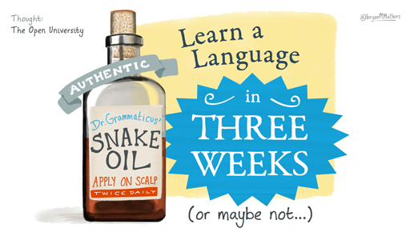

# 10 How long will it take?

__Figure 6 __Can you learn a language in three weeks?

Watch the following video, in which a group of people talk about how long they think it will take to learn a language.
<!--MEDIACONTENT--><video xmlns:str="http://exslt.org/strings" width="80%" download=""><source src="https://www.open.edu/openlearn/ocw/pluginfile.php/1395607/mod_oucontent/oucontent/71942/boc_lll_1_video_week1_voxpops1.mp4" type="video/mp4"></source></video><!--TRANSCRIPT--><table xmlns:str="http://exslt.org/strings" border="1"><tr><td>
__LEARNER 1:__ *To get to the level I want to get to more in learning German, I think probably between one and two years. I've been using duolingo now for nine months. I'm making good progress. I'm enjoying it, which is really important. But I think if I'm going to make much more progress, I'll need to do some more formal study, which helps me understand the structure of the language rather than just-- as good as duolingo is, it's not as basic as the old fashioned tapes where you're just repeating phrases or something. *;
*It's very interactive and I'm learning a lot with it. But I think if I'm going to meet my goals, I need to move from that sort of informal learning into a more formal context and actually study the language to some degree. *;

__LEARNER 2:__ *I'm learning Chinese at the moment. And I would love to be able to get to a point where I can hold a conversation with a native speaker. But unfortunately, I think this is going to take quite a long time to achieve. It's going to take many, many years I think, because you have to take into account the speaking and the listening aspects of this. So I think and the fact that I'm not living in China I think just means I have to take it gradually. But it's going to take me a number of years to get to that point. *;

__LEARNER 3:__ *I'm learning Spanish. The level I'm at currently is beginning advanced. I would like to continue until I have real fluency so I can speak and listen with confidence. And I hope one day to be able to return to Spain and work there. *;

__LEARNER 4:__ *I'm learning Japanese. And I'm hoping to be able to understand what my grandchildren say, because they are being brought up bilingual. I would like to be able to have a conversation with them. I can understand quite a lot of what they're saying. But I would like to be able to speak to them in Japanese as well. *;
*Oh, it'll take me ages. I'm useless at remembering the vocabulary. I think I've started it all too late, but it's still, it's very good because I can understand a lot more than I did when I started. *;
</td></tr></table><!--ENDTRANSCRIPT-->

<!--ENDMEDIACONTENT-->
How long it takes you to learn a language depends on several factors: 

* the level of proficiency you want to get to

* whether you are an experienced language learner or not

* the intensity, regularity and efficacy of your study routine

* how similar the language you are learning is to the language(s) you already speak

* how complex your target language is.

If you are a native speaker of English, you might find it easier to learn German, as they are both Germanic languages that share a lot of vocabulary and phonological features, than to learn Mandarin, where you would have to get to grips with a different writing system and with the fact that Mandarin is a tonal language, and where there are no similarities with English in the vocabulary, grammar or syntax.

There are many estimates of how long it may take a learner to reach each of the CEFR levels, but as a guideline, it might take you a couple of hundred hours to move between each of the six levels. As I’ve already said, learning a language is a marathon, not a sprint. So… beware of snake oil!

