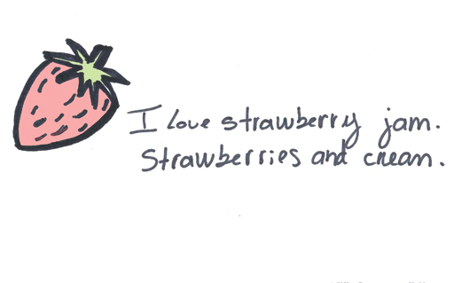
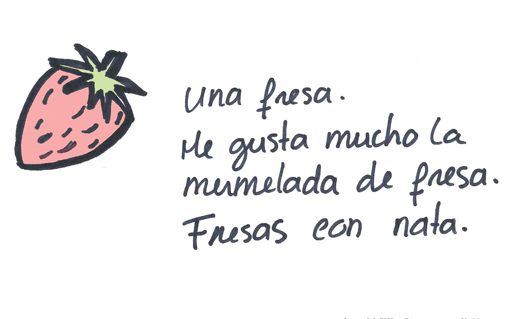
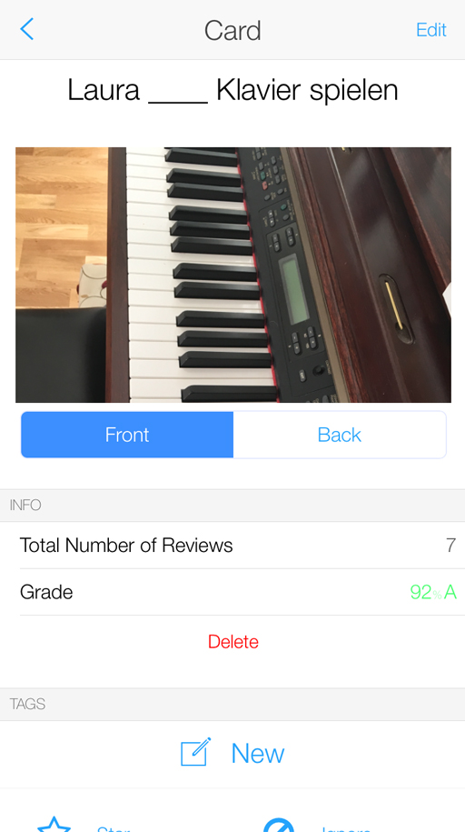
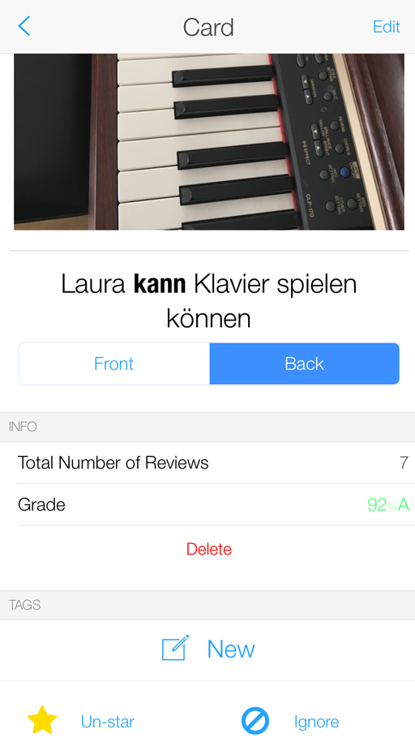
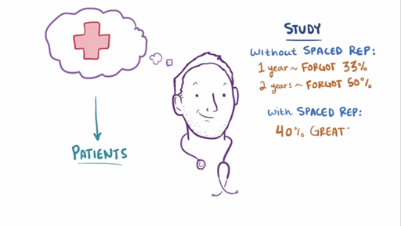
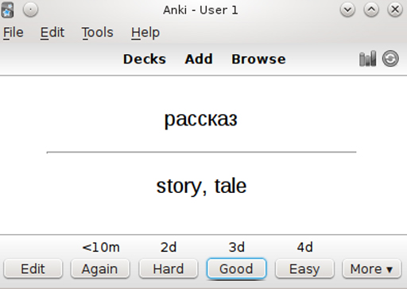

# 6 Effortful encoding strategies

So, what sort of effortful encoding strategies are we talking about? You will now look at the following useful effortful encoding strategies that will help you learn vocabulary:

* chunking

* mnemonics

* memory palaces

* self-referencing

* spacing.

## 6.1 Chunking

The first one is chunking, or grouping the information into meaningful units.

Listen to the following sequence of numbers. Don’t write them down.
<!--MEDIACONTENT--><!--ENDMEDIACONTENT-->
The reason why you can probably remember the second sequence, and not the first, is because you were able to chunk the information into meaningful bits of information, and that you could relate those numbers to categories you already had in your long-term memory – key dates in UK history.

When learning vocabulary, it is a lot easier to remember vocabulary items in categories that you already understand.

So for instance, it is easier to remember:

<!--Quote id=-->
>Oranges, bananas, pears
>Chicken, ham, soya beans
>Rice, pasta, bread

than it is to remember those same words in this sequence:

<!--Quote id=-->
>Oranges, ham, pears, bread, rice, soya beans, chicken,  pasta, bananas

The reason for that is that while the second list is in a totally arbitrary order, in the first one the items are grouped into categories that you are already familiar with (fruit, protein, carbs). So when you are learning lists of vocabulary in a foreign language, don’t just learn words in a random order, but put them into meaningful categories and that will help encode them into your long-term memory. You can do this, for instance, in a table or in a mind-map.

__Figure 2__ A way to categorise items.

__Figure 3__ Another way to categorise items.

## 6.2 Mnemonics

A second important encoding strategy is mnemonics. You probably learned some mnemonics at school. For instance, to learn the colours of the rainbow, you can remember the sentence: Richard Of York Gave Battle In Vain (red, orange, yellow, green, blue, indigo and violet), or to remember the order of the planets in our solar system, you can use the mnemonic: My Very Easy Method Just Speeds Up Naming Planets (the first one, closest to the Sun, is Mercury).

Although most people associate mnemonics with this sort of examples, mnemonics are indeed any sort of memory technique that helps retain information.

One useful mnemonic device is the use of __imagery__, and this can be very useful when learning new vocabulary.

Vocabulary cards or ‘flashcards’ are a useful way to learn vocabulary. They are cards that have the word you want to learn on one side and, usually, the translation of the word on the other. There are also flashcard apps you can use online, and you’ll review these in Week 8.

__Figure 4__ A flashcard.

__Figure 5__ The reverse of the flashcard.

Instead of having the word you want to learn on one side and the translation on the other, you can use vocabulary cards that have the word you want to learn on one side, and a picture on the other. And although you can find lots of these already made, it seems that if you actually spend a bit of time and make them yourself, with images that are either meaningful to you, or that you look for yourself, you are more likely to remember them (Wyner, 2014).

So here, for instance, is a card I made to learn the verb können (can) in German.

The front of the card show a sentence with a gap (Laura …. play the piano) in it and a picture, and the back contains the whole sentence, and the infinitive of the verb. What makes this card particularly meaningful to me is that Laura is my daughter, and that the piano in the picture is Laura’s piano. All this helps to encode the German into my long-term memory, because the new information can latch onto lots of other meaningful items that are in my memory already.

__Figure 6__ A flashcard.

__Figure 7__ A flashcard.

You don’t have to create actual images in flashcards to link to words in order to remember them; you can also make visual or auditory associations in your mind. For instance, polyglot Benny Lewis gives the example of the word ‘Leute’ in German, which means people. I used to find this a very difficult word to remember, as it bears no resemblance to the English word or to the word for people in any of the other languages I speak. What Benny Lewis suggests is imagining a bunch of PEOPLE LOITERING (Lewis, 2016, p. 29) – once you have that image in your head, it is difficult to forget the word.

With a bit of practice and imagination, you can make up these links between words yourself – and they only have to be meaningful to you. For instance, the German word ‘einladen’ means ‘to invite’. To my mind it sounds a lot like the Spanish word ‘helado’, ice-cream, and so the first time I heard ‘einladen’ I immediately thought of the image on one of my German friends inviting me for an ice-cream (‘einladen’ me for an ‘helado’, so to speak), and the new verb was immediately, and indelibly imprinted in my mind.

## 6.3 Memory palaces

Another way in which you can use mnemonics is through the technique known as __‘the method of loci’__ (from the Latin locus, place) also known as __the memory palace__
<!--MEDIACONTENT--><!--TRANSCRIPT--><table xmlns:str="http://exslt.org/strings" border="1"><tr><td>
__TITA BEAVEN:__ *Imagine a place you know well, such as your house, your office, or your street. Now walk around that place in your mind, and select ten specific spots in that place in the sequential order you would see them if you walked around it. For instance, in my house, the first room is the sitting room, where there is a sofa, the fireplace and the piano. Then there is the corridor, and a small toilet on the left. Then there is the kitchen, where I can see the dining table, the fridge, the sink and then the hob, etc.*;
*Now if you make a map of that place and identify those specific points in your map, you can use them to remember things. So for instance, here’s a random list of elements:*;
*mouse*;
*bottle of white wine*;
*strawberry*;
*birdcage*;
*stool*;
*biro*;
*shampoo*;
*lorry*;
*The way you would remember those words, in that specific order, is to place each them at a station of your memory palace, and to do so in such a way that each one represents a memorable image:*;
*So, using my memory palace of my house, I would imagine a mouse sitting on the sofa, reading the Sunday papers, then a bottle of white wine inside the fireplace, with a label on it saying ‘drink me’ and then a giant strawberry sitting at the piano playing the tune of Strawberry fields forever. As I go down the corridor, I can imagine seeing a giant birdcage and having to squeeze through the bars of the birdcage in order to get to the kitchen, where the kitchen table has been replaced by a stool, and we are sitting around it trying to make room for our tea on the tiny surface of the stool…. You get the idea…*;
</td></tr></table><!--ENDTRANSCRIPT--><!--ENDMEDIACONTENT-->
It is important that you remember the stations in your memory palace, and it helps to draw them. Here’s a map of the memory palace I used for this activity, with eight stations:

__Figure 8__ A memory palace.

This technique of the memory palace can be really useful to learn words in a foreign language too. You can rely on how the word sounds, what it reminds you of, etc, to make it memorable. Now you can put it into practice.
<!--MEDIACONTENT--><!--TRANSCRIPT--><table xmlns:str="http://exslt.org/strings" border="1"><tr><td>
__TITA BEAVEN:__ * Rather than using a language that you might already know, let’s try using a memory palace to learn some vocabulary from an invented language. The language is Toki Pona (or the language of good), a language invented by Canadian translator and linguist Sonja Lang.*;
*Here are three Toki Pona words.*;
*Meli: woman*;
*Ike: bad, negative, irrelevant*;
*Kala : fish, sea creature*;
*So the first word, Meli, means woman. I can imagine __Meli__sandre, the Red __Woman__ from the TV series Game of Thrones sitting on my sofa: meli = woman. Then, as I walk to the next station, the fireplace, I can imagine trying to build a fire with a lot of Ikea catalogues – as the stove fills with smoke, I realise this is a really bad idea (Ike = bad). Sitting at the piano is an enormous squid (__Cala__mari) playing the piano with its eight arms: Kala = sea creature…. and so on.*;
</td></tr></table><!--ENDTRANSCRIPT--><!--ENDMEDIACONTENT-->

### Activity 4 Creating a memory palace 
__Timing: Allow about 10 minutes__

#### Question

So now it’s your turn. First, create a memory palace around a place you know well, such as your home, and select ten ‘stations’ in your palace in the order in which you would encounter them if you were walking around it. It is useful to draw it, and number the stations, like I did.

Now, place one of the following Toki Pona words in each station, making memorable associations between the word and what it sounds like, or anything else that will help you remember it.

Jaki: disgusting, obscene

Insa: centre, content, inside

Kasi: plant

Lape: sleeping, resting

Kute: listen, hear

Noka: foot, leg, lower part

Linja, cord, hair, rope, thread

Poki: container, bag, bowl, box

Kili: fruit, vegetable

Nanpa: numbers

#### Discussion

I hope that doing this activity has shown you how you can use memory palaces to remember vocabulary. Try walking through your memory palace again tomorrow, and try to remember the Toki Pona words you placed there. And try it again in three days’ time, and again next week – by rehearsing your walk around your memory palace saying the words you have placed there, you are making your memories stronger. 

## 6.4 Self-referencing

So far, you have looked at chunking and mnemonics. A third key way to help encode information into your long-term memory is to think about how the information refers to you. So when you are learning new vocabulary, imagine yourself or those close to you in the memorable images and stories you make up to remember them, such as in the example of my daughter Laura playing the piano, or my German friend inviting me for an ice cream.

## 6.5 Spacing

One final very useful encoding strategy is spacing. When you prepare for an exam, do you spend a bit of time every day over several weeks studying for it, or are you a crammer, and leave it all till the last day and binge-study? Well, you might not be surprised to learn that ‘little and often’ is a much more effective encoding strategy than last-minute cramming. So, when you learn any aspect of the language, but especially vocabulary, learn a little every day.

Here's how it works! And although the video is aimed at medics rather than language learners, it all transfers to learning vocabulary!
<!--MEDIACONTENT--><video xmlns:str="http://exslt.org/strings" width="80%" download=""><source src="https://www.open.edu/openlearn/ocw/pluginfile.php/1395607/mod_oucontent/oucontent/71942/lll_1_wk6_vid11.mp4" type="video/mp4"></source></video>

<!--ENDMEDIACONTENT-->

### Activity 5 Evaluating spaced repetition 
__Timing: Allow about 30 minutes__

#### Question

So, spaced repetition can help you to learn vocabulary by making you review the words you can’t remember, rather than those that you can. There are lots of Spaced Repetition Software (or SRS) apps and software available. Try two or three to see which one you like best. Remember you might want to refer back to the framework for evaluating resources that Fernando introduced in Week 3. 

Here are some you can try out: 

[Anki](https://apps.ankiweb.net/)

[Duolingo Tinycards](https://tinycards.duolingo.com/)

[Memrise](https://www.memrise.com/) 

#### Discussion

I hope having a look at several flashcard apps has given you an idea of how they work and how spaced repetition can be a useful tool for learning new vocabulary. Over the next few days keep practising with one or two of them to understand their benefits more fully.

Figure 5 Using an app to learn a language

In this section, you have been introduced to a number of effective, effortful encoding strategies that will help you encode vocabulary into your long-term memory. 

Now watch the following video as a recap of these strategies : [Encoding strategies ](https://www.youtube.com/watch?time_continue=4&amp;v=mlrOJgyPySw)

