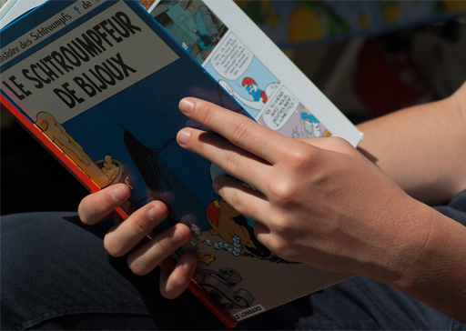

# 2 Reading

Leaving aside the issues of different alphabets and scripts, reading in the target language can present a number of challenges. In this and the next section  you will explore reading and writing separately in more depth.

## 2.1 I want to read texts in my target language: where should I start?

A text can be as short as a single word on a sign or as long as a novel, but length is just one of the factors you will want to consider when choosing reading material. As a language teacher, I’m often asked by my students for recommendations for what to read.

My reply is normally to ask them what they like to read in their own language. If they mostly read magazines, there isn’t much point in suggesting a literary classic, certainly in the early stages of their language learning. It could well put them off reading in their target language forever.

So if you like comic books, read comic books in your target language. If you like gossip magazines, then read those. Familiarity with the subject will make reading easier and looking up words in that subject will be a worthwhile activity for you, since you have an interest in the topic and will want to use that vocabulary when talking about the things you like.

__Figure 2__ Reading in a second language. 

Some people assume that children’s books are a good thing to start reading in the target language, after all, they are the first texts that children who are native to that language tend to encounter. While children’s books may have a simple plot, their language isn’t necessarily easier to understand. In fact, they may use expressions that children use and which even advanced language learners may have difficulty understanding if they’ve not had conversations with children who speak their target language. They also often have invented words, or very creative and playful use of language that learners might find puzzling. 

In Week 5, Olly introduced you to the idea of graded listening material, and graded reading materials also exist to help you practice your reading. So graded readers are a good place to start. They are books that have been simplified so that language learners can understand them better or books that have been specifically written for language learners. Their vocabulary and grammar complexity is graded for different levels of proficiency in the language, sometimes using the Council of Europe Reference Framework that Tita introduced you to in Week 1. They often come with vocabulary lists and comprehension activities.

### Laura says:

When I first started learning Spanish, I enjoyed reading graded readers. They often come with audio, so by listening as you read along, you can help train your ear as well as your eyes and learn how trickier words are pronounced.

Bilingual texts are also a great way to approach reading in the target language. They present the text in two languages, with one page in the target language followed by the same page in your first language. Although the language isn’t simplified as it is in graded readers, having the translation next to it helps the reader follow without having to stop every few words to look up meanings.

I often recommend to my students that they pick up a translation of their favourite book in the language they’re learning. Being familiar with the language, characters and plot of the book means that even if they don’t understand many words in the book, they don’t have to struggle with the vocabulary or the plot, as they know what’s happening. It can also be fun to discover what has been changed in the translation. The picture below shows how some of the words and characters in the Harry Potter series have been translated into different languages. There are some interesting choices!

__Figure 3__ Harry Potter revisioned.

### Activity 2 Research your favourite book 
__Timing: Allow about 15 minutes__

#### Question

Do an online search for the title of your favourite book, comic book or graphic novel in your target language. Does the title vary or is it a literal translation? What do you think of the cover image? Is it very different from the cover in your local edition? 

## 2.2 ‘Seeing a long text puts me off’

Learners often spend a long time reading a text, looking up words and structures, until they have fully understood it. Not all texts need to be read word for word and often you don’t need to understand every word to get the information you need from a text. 

Sometimes all you need is to get the gist of what the text is about. For example, when reading a newspaper, you may only be interested in the headline to tell you what the text is about and decide whether the text is of interest to you. Or you may have been asked to provide the answers to some questions to be found in a text. In that case, skimming the text so you can identify key words from the questions will help you find the information in a text without needing to read or understand every word of it. Sub-headings within a text will also provide clues as to whether you need to read a particular section or not. If the text is in digital format, a search for relevant words will help you too.

If you are looking for a certain piece of information, you may not even have to read for gist, just scanning the text will suffice. We do this all the time in our first language. Just like you don’t read the whole of a train timetable but just look for the information for the particular train you need, you can do the same with a text in the target language.

So remember, just like in your own language, when reading in a foreign language you don’t have to read every word in a text. Skimming (or reading for gist) and scanning are two reading strategies we all use when reading in our first language, and they are equally useful when reading in your target language.

### Activity 3 Skimming or scanning? 
__Timing: Allow about 5 minutes__

#### Question

Do you skim or scan in the following situations?

#### Question

Finding out the weather in your area from a newspaper weather report 

scan

skim

#### Question

Look through a TV guide to see if there’s anything you fancy watching

scan

skim

#### Question

Finding out what a news article is about 

scan

skim

#### Question

Finding out the price of an item in a catalogue 

scan

skim

#### Question

Flick through a book to see if you fancy reading it 

scan

skim

#### Question

Read the first couple of sentence of each paragraph of a long newspaper article to find out what it is about. 

scan

skim

#### Question

Finding out the departure of your flight in the airport display board

scan

skim

#### Discussion

Understanding the difference between when to skim and when to scan is very useful. Sometimes inexperienced language learners feel they need to read and understand every word in a text to make sense of it, and that is not the case, neither in your own language nor in a foreign one!

## 2.3 ‘It takes ages to look up every word in a text’

As we’ve stated before, there are ways in which you can decide whether you need to actually look up every word you encounter. It may be that it’s in a part of the text that doesn’t provide the information you need. But if you’re reading a work of fiction, you may want to make sure that you understand everything in the text. Guessing the meaning of words from the context they appear in is a helpful exercise. You won’t get it right every time, but you will also get used to using this strategy and get better at it.

